# SIH26122 — Intelligent Data Capture & Schedule-Linking Layer

> **AI-powered progress intelligence for linking heterogeneous site reports with L5/L6 EPC project schedules.**

[](https://www.python.org/)
[](https://fastapi.tiangolo.com/)
[](https://react.dev/)
[](https://www.typescriptlang.org/)
[](https://vitejs.dev/)
[](https://www.sqlite.org/)
[](https://docs.pytest.org/)
[](#-demo-mode)

---

## Table of Contents

- [🚀 Project Overview](#-project-overview)
- [🎯 Problem Statement](#-problem-statement)
- [💡 Solution](#-solution)
- [✨ Key Features](#-key-features)
- [🧠 AI Matching Engine](#-ai-matching-engine)
- [👥 Human-in-the-Loop Workflow](#-human-in-the-loop-workflow)
- [🏗️ System Architecture](#-system-architecture)
- [🛠️ Technology Stack](#-technology-stack)
- [📁 Project Structure](#-project-structure)
- [⚡ Quick Start](#-quick-start)
- [🎮 Demo Mode](#-demo-mode)
- [🔄 Data Flow](#-data-flow)
- [📋 Supported Input Data](#-supported-input-data)
- [📊 Matching Confidence Policy](#-matching-confidence-policy)
- [🔌 API Documentation](#-api-documentation)
- [🧪 Testing](#-testing)
- [🖼️ Screenshots & Demo](#-screenshots--demo)
- [🎬 SIH Demo Flow](#-sih-demo-flow)
- [💎 Why This Approach](#-why-this-approach)
- [🔮 Future Enhancements](#-future-enhancements)
- [🔐 Security & Configuration](#-security--configuration)
- [🔧 Troubleshooting](#-troubleshooting)
- [🤝 Contribution](#-contribution)
- [📄 License](#-license)
- [🏆 Acknowledgement](#-acknowledgement)

---

## 🚀 Project Overview

In large-scale infrastructure, oil & gas, and Engineering, Procurement, and Construction (EPC) projects, field execution data is fragmented across daily shift logs, contractor spreadsheets, and supervisor notes. Meanwhile, master project controls reside in Level 5 / Level 6 (L5/L6) schedule baselines containing hundreds or thousands of discrete activities.

**SIH26122 (InfraSync AI)** bridges this operational gap by providing an intelligent data capture and schedule-linking layer. The platform automatically ingests heterogeneous progress updates (unstructured text reports, CSV spreadsheets, and Excel workbooks), extracts structured execution events, and maps them to baseline schedule activities using a **5-signal AI matching engine**.

Key operational guarantees:
- **High-Confidence Automation**: Verifiable matches ($\ge 0.85$ confidence) are linked automatically without manual overhead.
- **Human-in-the-Loop (HITL) Validation**: Borderline ($0.65 - 0.84$) and ambiguous matches are flagged for supervisor review with explainable AI reasoning.
- **Zero Data Loss**: Low-confidence records are preserved in an unmatched pool rather than silently dropped.
- **Complete Provenance**: Every parsing action, matching decision, approval, and rejection is permanently recorded in a tamper-evident audit log.

---

## 🎯 Problem Statement

Complex industrial projects encounter systematic friction when tracking actual progress against baseline plans:

1. **Heterogeneous & Inconsistent Formats**: Daily progress is recorded in narrative TXT memos, discipline-specific CSVs, and Excel tracking sheets with varying column headers, abbreviations, and units.
2. **Vocabulary Mismatch**: Field teams report work in colloquial trades terminology (e.g., *"completed erection of spool SP-104"*), whereas schedules specify contractual WBS descriptions (e.g., *"Fabrication & Erection of Aboveground Carbon Steel Pipe Spools - Area A"*).
3. **Manual Mapping Bottlenecks**: Project planners spend hours manually cross-referencing progress logs with L5/L6 activities in Primavera P6 or MS Project.
4. **Error Propagation**: Mismapped activities lead to distorted Earned Value Management (EVM), undetected critical-path delays, and inaccurate payment milestone claims.
5. **Lack of Verifiable Audit Trails**: Manual Excel reconciliations lack traceability regarding who linked an event, what confidence threshold was applied, and when the link was approved.

---

## 💡 Solution

The platform resolves these challenges through an automated 10-stage pipeline:

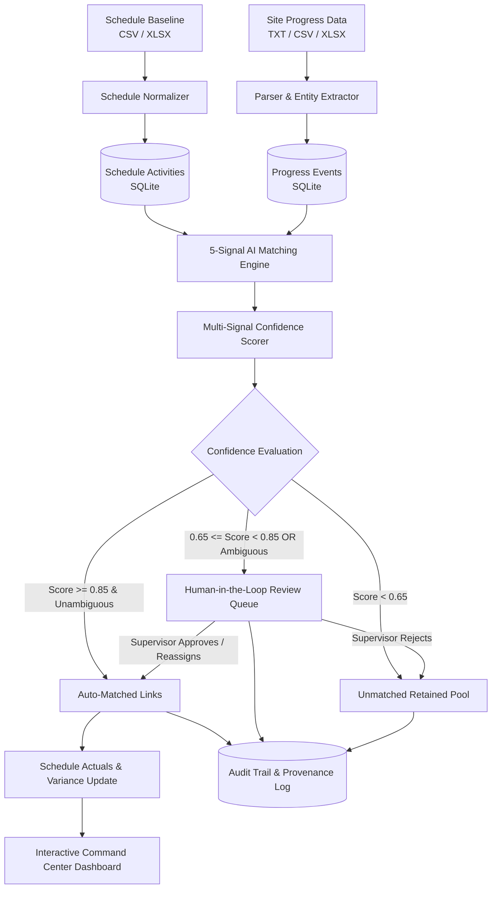

1. **Ingest Baseline Schedule**: Imports L5/L6 WBS activities, planned start/finish dates, and discipline metadata.
2. **Ingest Site Progress**: Accepts unstructured supervisor shift reports, trade CSVs, and Excel updates.
3. **Parse & Normalize**: Cleans dates, standardizes column schemas, and cleans descriptions.
4. **Extract Signals**: Identifies disciplines, event types (start, progress, completion, issue), locations, and timestamps.
5. **Multi-Signal Comparison**: Evaluates description semantics, discipline matrices, identifier tokens, location proximity, and date compatibility.
6. **Confidence Scoring**: Combines signals using weighted domain scoring and runs candidate ambiguity checks.
7. **Auto-Match High Confidence**: Automatically commits unambiguous links scoring $\ge 0.85$.
8. **Route Ambiguous/Medium Matches**: Sends scores between $0.65 - 0.84$ or close candidates ($\Delta \le 0.08$) to the HITL Review Queue.
9. **Retain Unmatched Events**: Retains low-confidence events ($< 0.65$) for planner investigation.
10. **Record Cryptographic Audit Log**: Logs timestamps, decision rationales, confidence scores, and user actions.

---

## ✨ Key Features

- **L5/L6 Schedule Baseline Ingestion**: Supports CSV and XLSX schedules with automatic column normalization for activity IDs, WBS codes, planned dates, disciplines, and locations.
- **Heterogeneous Progress Capture**: Ingests narrative daily reports (`.txt`), contractor progress logs (`.csv`), and multi-sheet workbooks (`.xlsx`).
- **5-Signal AI Matching Engine**: Evaluates matches using semantic description similarity, discipline matrices, token/identifier overlap, location proximity, and planned date window compatibility.
- **Candidate Ambiguity Detection**: Automatically flags candidate collisions when top matches fall within $\Delta \le 0.08$ of each other, preventing false automatic linkages.
- **Human-in-the-Loop Review Queue**: Dedicated workflow interface enabling supervisors to approve top candidates, reassign to alternative matching candidates, or reject with audit notes.
- **Interactive Controls Command Center**: Responsive React dashboard featuring KPIs, discipline coverage distributions, confidence histograms, and planned vs. actual schedule variance tracking.
- **Schedule WBS Explorer**: Hierarchical tree explorer displaying planned timelines, execution statuses, and linked actuals per activity.
- **Progress Events Log**: Granular view of all extracted site events with filtering by discipline, ingestion source, and linkage status.
- **AI Time Agent**: Conversational project assistant with strict intent detection that separates queries from execution progress reports and drafts progress entries from natural language.
- **Institutional Memory & Domain Lexicon**: Searchable EPC terminology dictionary (RCC, NDT, RT, Spool, Piling, Cable Tray, etc.) alongside historical learning statistics.
- **Immutable Provenance & Audit Trail**: Chronological event ledger recording every ingestion, automated match, supervisor decision, and status transition.
- **Zero-Dependency Demo Mode**: Fully operational out-of-the-box using deterministic TF-IDF and heuristic algorithms—no paid cloud API keys or external services required.

---

## 🧠 AI Matching Engine

The matching engine fuses five distinct signals into a unified confidence score $C \in [0.0, 1.0]$:

$$\text{Confidence} = 0.35 \cdot S_{\text{desc}} + 0.25 \cdot S_{\text{discipline}} + 0.20 \cdot S_{\text{token/id}} + 0.10 \cdot S_{\text{location}} + 0.10 \cdot S_{\text{date}}$$

### Signal Breakdown

| Signal | Weight | Formulation & Method | Description |
| :--- | :---: | :--- | :--- |
| **Description Similarity** ($S_{\text{desc}}$) | **35%** | TF-IDF Cosine Similarity + Jaccard + SequenceMatcher | Compares event descriptions against activity descriptions after stop-word removal and EPC synonym expansion. |
| **Discipline Similarity** ($S_{\text{discipline}}$) | **25%** | Domain Compatibility Matrix | Exact match = $1.0$; Related disciplines (e.g., Piping $\leftrightarrow$ Mechanical, Electrical $\leftrightarrow$ Instrumentation) = $0.6$; General = $0.7$; Mismatch = $0.1$. |
| **Token & ID Overlap** ($S_{\text{token/id}}$) | **20%** | Regex Word-Boundary ID Matching + Jaccard Token Overlap | Exact activity ID in text = $1.0$; Partial clean ID match = $1.0$; Token set intersection rewards $\ge 3$ overlapping domain terms with scores up to $0.90$. |
| **Location Similarity** ($S_{\text{location}}$) | **10%** | Substring Containment + SequenceMatcher Ratio | Exact or substring location match = $1.0$; Fuzzy ratio otherwise; Neutral fallback ($0.7$) when location is omitted in reports. |
| **Date Compatibility** ($S_{\text{date}}$) | **10%** | Planned Start/Finish Range Evaluator | Event within planned window = $1.0$; Within $\pm 60$ days tolerance = $0.85 - 0.90$; Beyond window = $0.50$; Neutral fallback ($0.8$) when dates are missing. |

### Candidate Ambiguity Guard
If the difference between the top candidate's confidence score and the second candidate's score is within **8%** ($\Delta \le 0.08$) and both candidates score $\ge 0.65$, the system triggers an **Ambiguity Warning**. Even if the top score exceeds $0.85$, automatic linking is halted and the record is routed to the HITL Review Queue with both candidates presented for human judgment.

---

## 👥 Human-in-the-Loop Workflow

The Human-in-the-Loop (HITL) subsystem ensures that project controls engineers maintain supervisory authority over uncertain linkages.

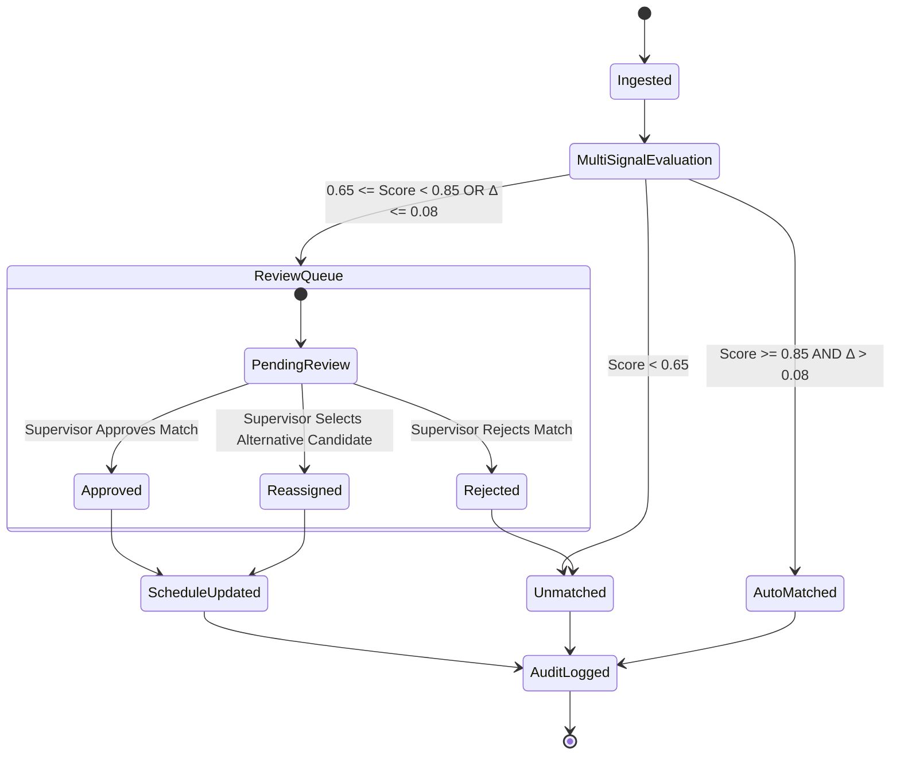

- **Candidate Transparency**: Supervisors view signal breakdowns ($S_{\text{desc}}$, $S_{\text{discipline}}$, $S_{\text{token}}$, $S_{\text{location}}$, $S_{\text{date}}$) and machine-generated explanations for why each candidate was suggested.
- **Alternative Selection**: If an ambiguity occurred, the alternative candidate is displayed side-by-side with its corresponding confidence rating.
- **Non-Destructive Rejection**: Rejecting a match returns the progress event to the unmatched pool with supervisor notes without deleting historical data.

---

## 🏗️ System Architecture

```mermaid
graph TB
    subgraph Client["Presentation Layer (React 18 + Vite)"]
        UI_Dash["Dashboard (Recharts KPIs & Variance)"]
        UI_Ingest["Data Ingestion & Parser Sandbox"]
        UI_Sched["Schedule WBS Explorer"]
        UI_Events["Progress Events Viewer"]
        UI_Review["HITL Review Queue"]
        UI_Agent["AI Time Agent (Chat & Log)"]
        UI_Memory["Institutional Memory Lexicon"]
    end

    subgraph Server["Application Layer (FastAPI Backend)"]
        R_Health["/health"]
        R_Sched["/api/v1/schedule"]
        R_Prog["/api/v1/progress"]
        R_Match["/api/v1/matching"]
        R_Dash["/api/v1/dashboard"]
        R_Audit["/api/v1/audit"]
        R_Agent["/api/v1/agent"]
        R_Mem["/api/v1/memory"]
    end

    subgraph CoreServices["Processing & Intelligence Services"]
        P_TXT["TXT Parser (Regex & Entity Extractor)"]
        P_CSV["CSV Parser (Pandas Column Normalizer)"]
        P_XLSX["XLSX Parser (OpenPyXL Normalizer)"]
        S_Match["MatchingService (5-Signal Engine)"]
        S_AI["FallbackAIProvider (TF-IDF + Lexicon)"]
        S_Audit["AuditService (Activity Logging)"]
    end

    subgraph DataTier["Persistence Layer (SQLite Database)"]
        DB_SA[("schedule_activities")]
        DB_PE[("progress_events")]
        DB_MC[("match_candidates")]
        DB_RI[("review_items")]
        DB_AL[("audit_logs")]
    end

    Client -->|HTTP / JSON via Vite Proxy| Server
    Server --> CoreServices
    CoreServices --> DataTier
```

### Component Breakdown

| Layer | Component | Technology | Responsibility |
| :--- | :--- | :--- | :--- |
| **Frontend** | Command Center UI | React 18, TypeScript, Vite | User interface, state management, modal drawers, and interactive data tables. |
| **Frontend** | Visual Analytics | Recharts, Lucide Icons | Real-time charts for discipline progress, confidence distribution, and schedule variance. |
| **Backend** | REST API Server | FastAPI, Uvicorn | Routing, request validation, exception handling, and CORS middleware. |
| **Backend** | Ingestion Parsers | Pandas, OpenPyXL, Python `re` | Ingests and normalizes CSV, XLSX, and free-text TXT reports into uniform schemas. |
| **Backend** | AI Matching Service | Scikit-learn, Difflib, Math | Implements 5-signal fusion, TF-IDF vectorization, synonym expansion, and ambiguity detection. |
| **Backend** | AI Time Agent | Rule-based Intent Classifier + Regex | Natural language progress extraction and conversational status query responder. |
| **Persistence** | Relational Store | SQLite3 (Row Factory) | ACID-compliant storage for schedule baselines, execution actuals, matches, and audit trails. |

---

## 🛠️ Technology Stack

| Category | Technology | Version | Purpose in Repository |
| :--- | :--- | :--- | :--- |
| **Frontend Core** | React | `^18.2.0` | Declarative component UI framework |
| **Language (Frontend)** | TypeScript | `^5.2.2` | Static type safety across models and API clients |
| **Build Tool** | Vite | `^5.1.6` | Development server and production bundler with reverse proxy |
| **Styling** | Vanilla CSS | CSS3 Tokens | Modular custom design system with dark mode aesthetics |
| **Charts & Icons** | Recharts, Lucide React | `^2.12.3`, `^0.359.0` | Progress charts, distribution histograms, and UI icons |
| **Backend Framework** | FastAPI | `>=0.110.0` | Asynchronous Python REST API framework |
| **ASGI Server** | Uvicorn | `>=0.28.0` | High-performance ASGI server |
| **Data Validation** | Pydantic | `>=2.6.0` | Request/response schemas and entity validation |
| **Spreadsheet Parsing** | Pandas, OpenPyXL | `>=2.2.0`, `>=3.1.2` | Tabular data manipulation and Excel `.xlsx` ingestion |
| **Machine Learning / NLP** | Scikit-learn, Difflib | `>=1.4.0`, Standard Lib | TF-IDF calculation, cosine similarity, SequenceMatcher |
| **Database** | SQLite3 | 3.x | Lightweight embedded relational database |
| **Testing** | Pytest, HTTPX | `>=8.0.0`, `>=0.27.0` | Automated test suite and asynchronous API client testing |

---

## 📁 Project Structure

```text
SIH/
├── backend/                        # FastAPI Backend Application
│   ├── ai/                         # AI & NLP matching modules
│   │   ├── embeddings.py           # Multi-signal similarity & compatibility evaluators
│   │   ├── fallback.py             # Deterministic TF-IDF provider & domain lexicon
│   │   └── provider.py             # AI provider abstract base class & factory
│   ├── database/                   # SQLite database models & seed loader
│   │   ├── connection.py           # Database connection & schema initializer
│   │   ├── models.py               # Pydantic schemas & SQLite table definitions
│   │   └── seed.py                 # Baseline schedule seed loader (32 sample activities)
│   ├── parsers/                    # Ingestion file parsers
│   │   ├── csv_parser.py           # Flexible CSV parser with column mapping
│   │   ├── txt_parser.py           # Regex-based free-text daily report parser
│   │   └── xlsx_parser.py          # Excel workbook parser via OpenPyXL
│   ├── routers/                    # FastAPI REST API endpoints
│   │   ├── agent.py                # AI Time Agent & Institutional Memory endpoints
│   │   ├── audit.py                # System provenance & audit trail queries
│   │   ├── dashboard.py            # Aggregated analytics & variance metrics
│   │   ├── matching.py             # Matching engine execution & review actions
│   │   ├── progress.py             # Progress data upload & preview parser
│   │   └── schedule.py             # Schedule baseline upload & activities query
│   ├── services/                   # Business logic layer
│   │   ├── audit_service.py        # Centralized audit logging service
│   │   ├── dashboard_service.py    # Metric aggregation & schedule variance calculator
│   │   ├── matching_service.py     # 5-signal matching engine & review manager
│   │   ├── progress_service.py     # Progress event storage & queries
│   │   └── schedule_service.py     # Schedule baseline persistence & queries
│   ├── config.py                   # Central environment & path settings
│   ├── main.py                     # FastAPI application entry point
│   └── requirements.txt            # Python dependencies
├── data/                           # Sample datasets for evaluation
│   ├── daily_report_civil.txt      # Sample civil daily site report (unstructured TXT)
│   ├── daily_report_electrical.txt # Sample electrical daily report (unstructured TXT)
│   ├── daily_report_piping.txt     # Sample piping daily site report (unstructured TXT)
│   ├── progress_civil.csv          # Sample civil progress updates (CSV)
│   ├── progress_piping.csv         # Sample piping progress updates (CSV)
│   ├── sample_schedule.csv         # 32-activity L5/L6 baseline schedule (CSV)
│   └── sample_schedule.xlsx        # 32-activity L5/L6 baseline schedule (XLSX)
├── docs/                           # Documentation and visual preview assets
│   ├── images/                     # Verified application UI screenshots
│   ├── ARCHITECTURE.md             # Technical architecture specification
│   ├── SIH26122_Project_User_Manual.md # Complete user guide
│   └── SIH26122_Project_User_Manual.pdf # Formatted PDF manual
├── frontend/                       # React 18 + Vite Frontend Application
│   ├── src/
│   │   ├── api/client.ts           # Type-safe API client interface
│   │   ├── components/             # Reusable UI components & drawers
│   │   │   ├── ActivityDetailDrawer.tsx # Baseline activity inspection drawer
│   │   │   ├── ConfidenceBadge.tsx      # Color-coded confidence indicator
│   │   │   ├── EventDetailDrawer.tsx    # Progress event inspection drawer
│   │   │   ├── FileUpload.tsx           # Drag-and-drop file ingestion component
│   │   │   ├── GlobalSearchModal.tsx    # Multi-entity search modal (Ctrl+K)
│   │   │   ├── Layout.tsx               # Top-level shell with navigation
│   │   │   ├── Sidebar.tsx              # Application sidebar navigation
│   │   │   ├── StatsCard.tsx            # KPI metric card component
│   │   │   └── ToastContext.tsx         # Notification toast system
│   │   ├── pages/                  # Top-level view controllers
│   │   │   ├── AITimeAgent.tsx          # Conversational project controls agent
│   │   │   ├── Dashboard.tsx            # Main analytics command center
│   │   │   ├── DataIngestion.tsx        # File upload & parser preview sandbox
│   │   │   ├── InstitutionalMemory.tsx  # Domain lexicon & learning metrics
│   │   │   ├── ProgressEvents.tsx       # Progress actuals log & filters
│   │   │   ├── ReviewQueue.tsx          # HITL supervisor review interface
│   │   │   └── ScheduleExplorer.tsx     # Hierarchical WBS schedule explorer
│   │   ├── styles/index.css        # Custom CSS tokens & dark theme
│   │   ├── types/index.ts          # TypeScript domain type definitions
│   │   ├── App.tsx                 # Root component with routing
│   │   └── main.tsx                # React DOM entry point
│   ├── package.json                # Frontend dependencies & npm scripts
│   ├── tsconfig.json               # TypeScript compiler configuration
│   └── vite.config.ts              # Vite configuration & backend proxy
├── tests/                          # Automated Pytest suite (41 tests)
│   ├── conftest.py                 # Pytest fixtures & isolated in-memory DB
│   ├── test_adversarial.py         # Boundary & synonym stress tests
│   ├── test_agent_intent.py        # Strict intent guard validation tests
│   ├── test_ambiguity.py           # Candidate collision & ambiguity tests
│   ├── test_api.py                 # End-to-end REST API integration tests
│   ├── test_deduplication.py       # Event deduplication & idempotency tests
│   ├── test_electrical_and_variance.py # Variance math & electrical report tests
│   ├── test_matching.py            # Matching engine unit tests
│   └── test_parsers.py             # CSV, XLSX, and TXT parsing tests
├── start.bat                       # One-click Windows runner (opens both servers + browser)
├── start.py                        # Cross-platform Python launcher
└── README.md                       # Master project documentation
```

---

## ⚡ Quick Start

### Prerequisites
- **Python 3.10+** (Tested up to Python 3.14)
- **Node.js 18+** & **npm**

---

### Option A: One-Click Launch (Windows)
Double-click [start.bat](file:///c:/Users/shiva/Desktop/SIH_2k26/SIH/start.bat) from the root folder. It initializes the backend, starts the Vite frontend, and automatically opens `http://localhost:5173` in your default browser.

---

### Option B: Cross-Platform Python Launcher
From the project root:
```bash
python start.py
```

---

### Option C: Manual Terminal Launch

#### 1. Backend Setup & Start
```bash
# Navigate to backend directory
cd backend

# Install dependencies
python -m pip install -r requirements.txt

# Start FastAPI server
python -m uvicorn main:app --host 0.0.0.0 --port 8000 --reload
```

#### 2. Frontend Setup & Start
```bash
# In a new terminal, navigate to frontend directory
cd frontend

# Install dependencies
npm install

# Start Vite development server
npm run dev
```

### Access URLs

| Interface | URL | Purpose |
| :--- | :--- | :--- |
| **Frontend UI** | [http://localhost:5173](http://localhost:5173) | Main application command center |
| **Backend API** | [http://127.0.0.1:8000](http://127.0.0.1:8000) | Root FastAPI server |
| **Swagger OpenAPI Docs** | [http://127.0.0.1:8000/docs](http://127.0.0.1:8000/docs) | Interactive API exploration and testing |
| **Health Check** | [http://127.0.0.1:8000/health](http://127.0.0.1:8000/health) | Service status & active AI provider verification |

---

## 🎮 Demo Mode

The application operates in **DEMO MODE** by default:
- **Zero API Keys Required**: Does not require OpenAI, Gemini, or external cloud tokens to run full semantic matching and natural-language progress extraction.
- **Deterministic & Reproducible**: Employs an embedded TF-IDF vectorizer coupled with a domain-specific engineering lexicon (`backend/ai/fallback.py`) for consistent, instantaneous evaluations during presentations.
- **Pre-Seeded Data**: Automatically seeds 32 Level 5/Level 6 baseline activities spanning **Piping**, **Civil**, and **Electrical** disciplines if starting with a fresh database.
- **Sample Datasets Included**: Ready-to-upload files are provided in the `data/` folder:
  - `sample_schedule.csv` / `sample_schedule.xlsx`
  - `daily_report_piping.txt`, `daily_report_civil.txt`, `daily_report_electrical.txt`
  - `progress_piping.csv`, `progress_civil.csv`

---

## 🔄 Data Flow

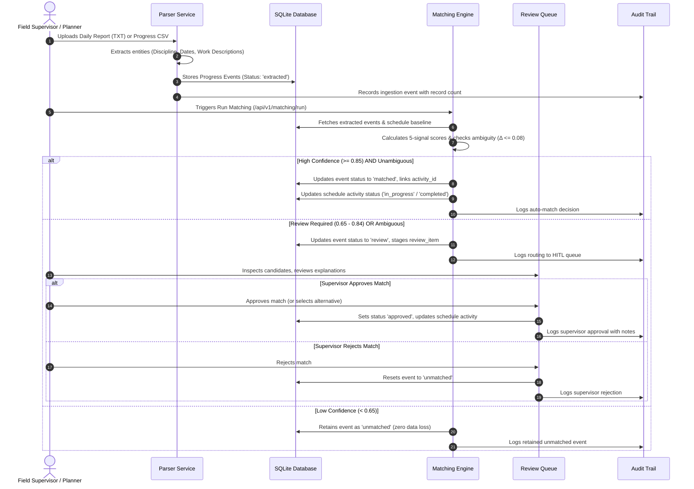

---

## 📋 Supported Input Data

| Input Category | Supported Formats | Expected Columns / Entities | Sample File in Repo |
| :--- | :--- | :--- | :--- |
| **Schedule Baseline** | `.csv`, `.xlsx`, `.xls` | `activity_id`, `wbs`, `discipline`, `description`, `planned_start`, `planned_finish`, `location`, `status` | `data/sample_schedule.csv`, `data/sample_schedule.xlsx` |
| **Daily Site Reports** | `.txt` (Natural Language) | Report Date, Discipline header, Numbered activity log, Inline start/finish dates, percent completion | `data/daily_report_piping.txt`, `data/daily_report_civil.txt`, `data/daily_report_electrical.txt` |
| **Discipline Progress Updates** | `.csv`, `.xlsx`, `.xls` | `event_date`, `discipline`, `activity_code`, `description`, `quantity`, `unit`, `percent_complete`, `location`, `remarks` | `data/progress_piping.csv`, `data/progress_civil.csv` |

---

## 📊 Matching Confidence Policy

| Confidence Score | Decision | System Action | Rationale |
| :---: | :---: | :--- | :--- |
| **$\ge 0.85$** | **Automatic Match** | Links progress event to activity; updates planned vs. actual schedule variance immediately. | High multi-signal alignment across semantics, discipline, and identifiers ensures reliable linking without human intervention. |
| **$0.65 - 0.84$** | **Human Review Queue** | Stages candidate link in HITL Review Queue with detailed signal explanation. | Marginal alignment indicates potential trade ambiguity or partial activity scope that requires supervisor judgment. |
| **Any ($\Delta \le 0.08$)** | **Candidate Ambiguity** | Halts automatic linking and routes both top candidates to HITL Review Queue. | Protects against false linkages when two activities have very similar wording or overlapping WBS descriptions. |
| **$< 0.65$** | **Retained as Unmatched** | Flags event as `unmatched`; preserves record in database for manual assignment. | Prevents erroneous schedule updates while preserving site actuals for scope dispute resolution. |

---

## 🔌 API Documentation

Interactive OpenAPI documentation is accessible at `http://127.0.0.1:8000/docs`.

### Core Endpoints

| Method | Endpoint | Tag | Description |
| :--- | :--- | :--- | :--- |
| `GET` | `/health` | Health | Service operational check, mode verification, and AI provider status. |
| `POST` | `/api/v1/schedule/upload` | Schedule | Upload CSV or XLSX schedule baseline to import L5/L6 activities. |
| `GET` | `/api/v1/schedule/activities` | Schedule | List schedule activities with optional `?discipline=` filter. |
| `POST` | `/api/v1/progress/upload` | Progress | Upload CSV, XLSX, or TXT daily report and persist extracted events. |
| `POST` | `/api/v1/progress/parse` | Progress | Sandbox preview parse of uploaded file without database persistence. |
| `GET` | `/api/v1/progress` | Progress | Retrieve progress events with optional `?status=` and `?discipline=` filters. |
| `POST` | `/api/v1/matching/run` | Matching | Execute 5-signal matching on all unlinked progress events. |
| `GET` | `/api/v1/matching/review` | Matching | Fetch pending items in the Human-in-the-Loop review queue. |
| `POST` | `/api/v1/matching/{match_id}/approve` | Matching | Approve a match candidate (supports specifying an alternative activity). |
| `POST` | `/api/v1/matching/{match_id}/reject` | Matching | Reject a candidate link and reset progress event to unmatched. |
| `GET` | `/api/v1/dashboard` | Dashboard | Retrieve aggregated KPIs, discipline breakdown, and schedule variances. |
| `GET` | `/api/v1/audit` | Audit | Query chronological provenance audit log with `?limit=` and `?entity_type=`. |
| `POST` | `/api/v1/agent/query` | AI Agent | Query project schedule, delays, actuals, and variances via natural language. |
| `POST` | `/api/v1/agent/log-progress` | AI Agent | Extract structured draft progress event from natural-language message. |
| `POST` | `/api/v1/agent/confirm-progress`| AI Agent | Confirm draft progress event and commit link to schedule with audit log. |
| `GET` | `/api/v1/memory` | Institutional Memory | Retrieve domain lexicon mappings and historical learned link statistics. |

---

## 🧪 Testing

The repository contains a test suite executed via `pytest`. All 41 tests pass in an isolated in-memory SQLite database:

```bash
# Execute full test suite from project root
python -m pytest tests/ -v
```

### Test Coverage Highlights

| Test Module | Tests | Scope Verified |
| :--- | :---: | :--- |
| `test_adversarial.py` | 4 | Domain synonym resolution, discipline mismatch penalties, activity ID word-boundary enforcement, and nonsensical text handling. |
| `test_agent_intent.py` | 15 | Strict intent guarding (preventing conversational messages like "hello" from triggering progress extraction), timestamp preservation, and unmatched handling. |
| `test_ambiguity.py` | 2 | Ambiguity detection when top candidate scores are within $\Delta \le 0.08$, alternative candidate routing, and alternative candidate approval. |
| `test_api.py` | 9 | End-to-end REST endpoint execution across schedule, progress, matching, review, dashboard, audit, and agent APIs. |
| `test_deduplication.py` | 2 | File upload deduplication and matching engine execution idempotency. |
| `test_electrical_and_variance.py` | 2 | Parsing electrical daily reports and verifying mathematical schedule variance calculations ($Actual - Planned$). |
| `test_matching.py` | 2 | Full multi-signal matching execution, confidence threshold routing, and approve/reject state transitions. |
| `test_parsers.py` | 5 | CSV, XLSX, and TXT parser integrity across Piping, Civil, and Electrical discipline report formats. |

---

## 🖼️ Screenshots & Demo

All UI views are implemented and verified in the repository under `docs/images/`:

| View | Screenshot |
| :--- | :--- |
| **Command Center Dashboard** | 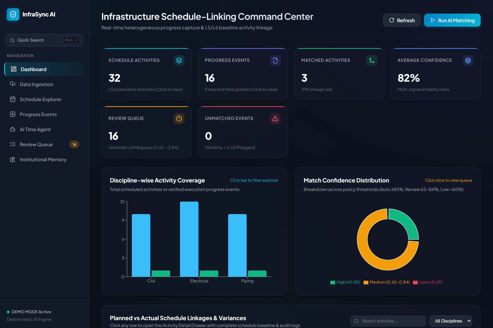 |
| **Data Ingestion & Parser Sandbox** | 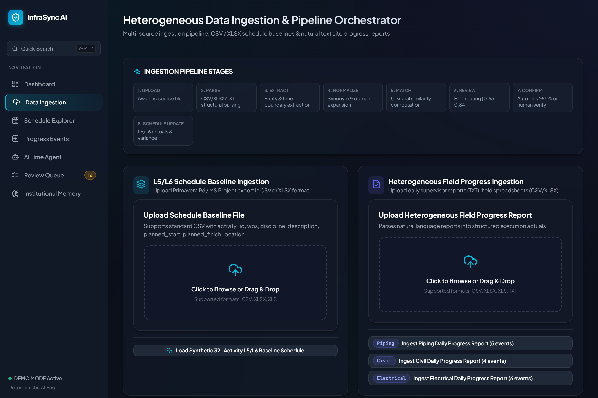 |
| **Schedule WBS Explorer** | 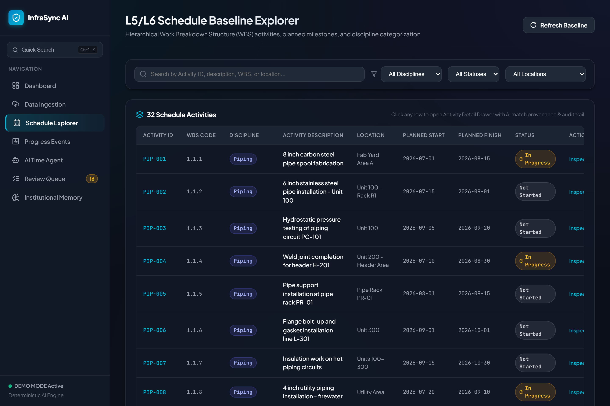 |
| **Extracted Progress Events Log** | 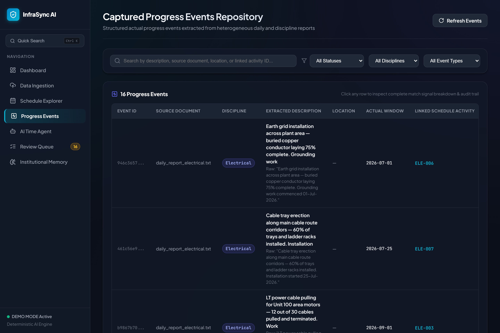 |
| **Human-in-the-Loop Review Queue** | 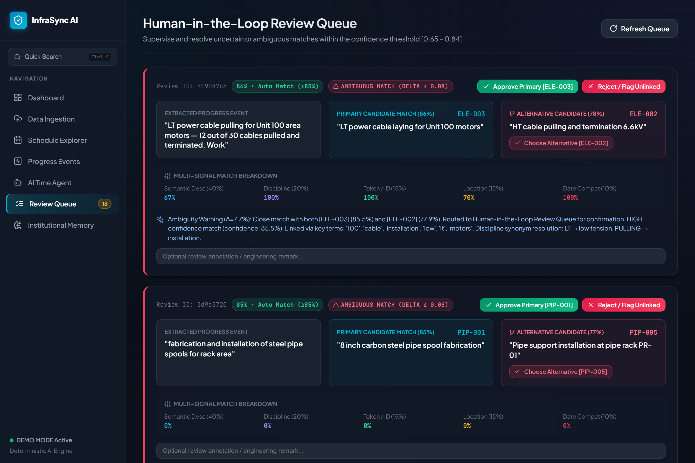 |
| **AI Time Agent (Chat & Field Logger)** | 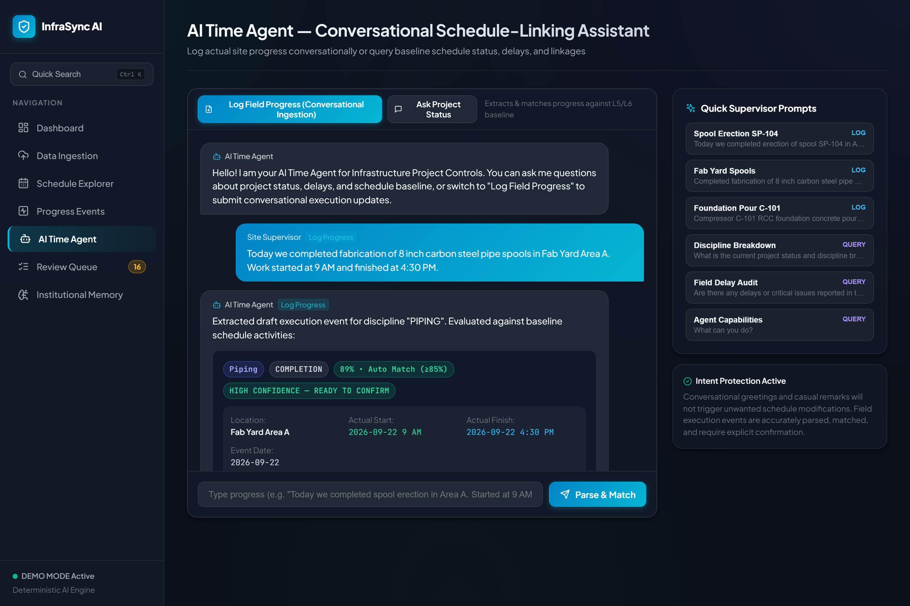 |
| **Institutional Memory & Domain Lexicon** | 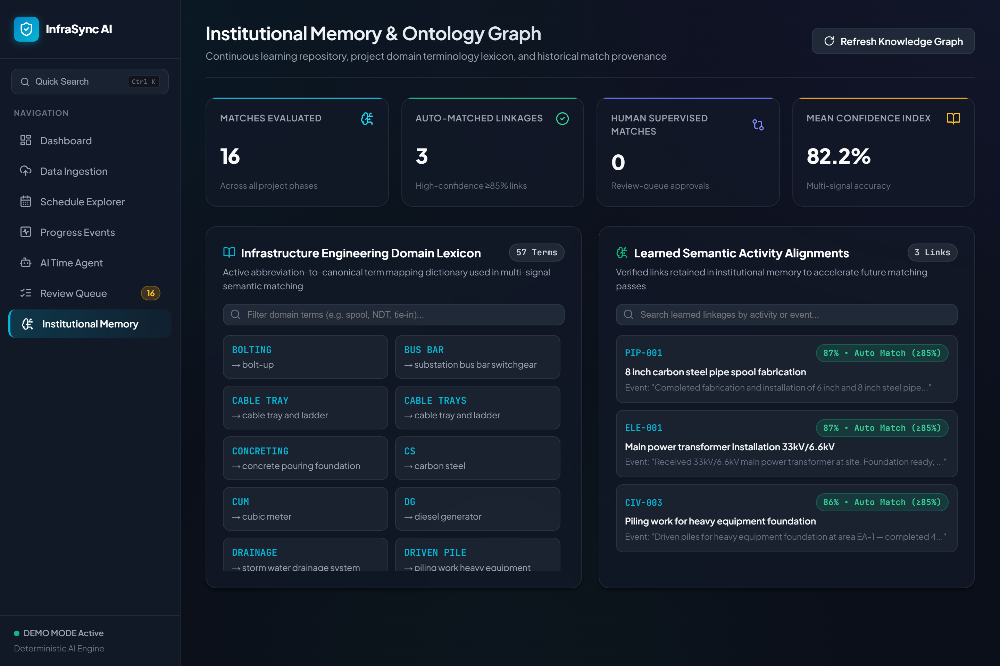 |
| **Cryptographic Provenance Audit Trail** | 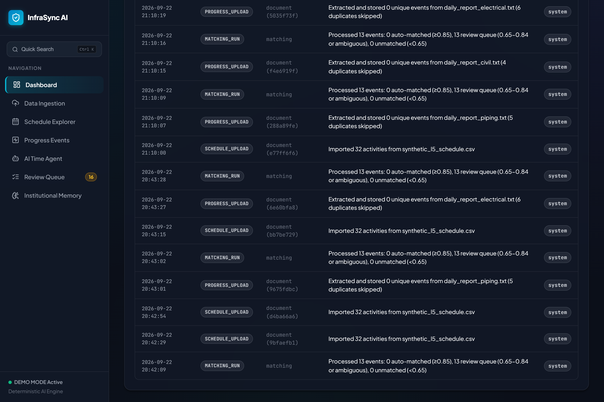 |

---

## 🎬 SIH Demo Flow

For judges and evaluators, follow this 10-step demonstration sequence:

1. **Inspect Baseline Schedule**: Navigate to **Schedule Explorer** to observe the pre-seeded Level 5/Level 6 activities (WBS hierarchy, planned dates, and disciplines).
2. **Ingest Unstructured Progress Report**: Go to **Data Ingestion**, drag & drop `data/daily_report_piping.txt`, and click **Upload & Ingest**.
3. **Inspect Parsed Events**: View the **Progress Events** tab to verify that the regex and NLP parsers extracted individual activities, disciplines, event types, and inline dates.
4. **Run AI Matching Engine**: Click the **Run AI Matching** button on the top navigation bar.
5. **Inspect Automatic Links**: Return to the **Dashboard** and **Progress Events** to observe that high-confidence matches ($\ge 0.85$) were linked automatically.
6. **Examine Review Queue**: Navigate to **Review Queue** to inspect borderline items ($0.65 - 0.84$) and candidate collisions flagged with `Ambiguity Warning`.
7. **Perform HITL Action**: Click **Approve** on a candidate match (or select an alternative candidate) to observe the transition to `approved`.
8. **Test Conversational AI Time Agent**: Open **AI Time Agent**, ask *"What is the status of Piping?"*, and then type *"Completed welding of spool SP-102 in Area A"* to observe real-time candidate ranking.
9. **Examine Institutional Memory**: Visit **Institutional Memory** to inspect the active engineering synonym dictionary and learning accuracy statistics.
10. **Verify Provenance & Audit Trail**: Open the **Audit Trail** from the sidebar to inspect the immutable log recording each ingestion, match, and supervisor approval with timestamps.

---

## 💎 Why This Approach

- **Multi-Signal Reliability Over Brittle Search**: Rather than relying solely on string matching or single-field queries, fusing description semantics, discipline compatibility, token identifiers, physical location, and planned date windows ensures resilience against noisy site data.
- **Explainable Automation**: Machine-generated rationales highlight matched terminology and synonym conversions, enabling reviewers to understand why a match was proposed.
- **Zero Silent Data Loss**: Conventional scrapers discard unmapped lines. InfraSync AI keeps unmatched records intact, allowing project teams to discover out-of-scope work or missing baseline items.
- **Safety via Intent Guarding**: The AI assistant rigorously classifies inputs so casual conversational queries never inadvertently corrupt project databases.
- **Audit Compliance**: Infrastructure and EPC projects involve legal claims and milestone verifications. Built-in audit logging ensures every linkage decision is documented and defendable.

---

## 🔮 Future Enhancements

*The following items represent prospective enhancements for production industrial deployment:*

- **Dense Embedding Models**: Integration of transformer-based sentence encoders (e.g., Sentence-BERT or fine-tuned EPC domain models) for complex multi-lingual phrasing.
- **Direct Primavera P6 / MS Project Connectors**: Native API synchronization with Oracle Primavera P6 (XER / XML) and Microsoft Project.
- **Role-Based Access Control (RBAC)**: Fine-grained permissions separating Field Supervisors, Project Controls Leads, and Contract Administrators.
- **Production Database Backend**: Migration from embedded SQLite to high-concurrency PostgreSQL with row-level security.
- **Computer Vision Ingestion**: OCR processing for scanned paper daily logs, equipment delivery tickets, and handwritten site chalkboards.
- **Real-Time Push Notifications**: Webhook and notification integration for immediate supervisor alerts when schedule variance anomalies are detected.

---

## 🔐 Security & Configuration

### Configuration Options
All backend settings are managed in `backend/config.py` and can be overridden via environment variables:

| Variable | Default Value | Description |
| :--- | :--- | :--- |
| `SIH_HOST` | `0.0.0.0` | Host interface for FastAPI server |
| `SIH_PORT` | `8000` | Port for FastAPI server |
| `SIH_DEBUG` | `true` | Enables verbose debug logging |
| `SIH_DB_PATH` | `database/sih.db` | Absolute or relative path to SQLite database |
| `SIH_AI_PROVIDER` | `fallback` | AI provider (`fallback`, `openai`, `gemini`) |
| `SIH_AUTO_MATCH` | `0.85` | Confidence threshold for automatic matching |
| `SIH_REVIEW_THRESHOLD` | `0.65` | Confidence threshold for review queue routing |
| `OPENAI_API_KEY` | *(empty)* | Optional API key if using cloud provider |
| `GEMINI_API_KEY` | *(empty)* | Optional API key if using cloud provider |

### Security Safeguards
- **Zero Hardcoded Secrets**: No credentials or API keys are stored in the codebase.
- **Protected Environment Files**: Standard `.gitignore` rules prevent accidental commits of `.env` files, credentials, local databases (`*.db`, `*.sqlite`), and cache folders.
- **Input Validation**: Strict validation via Pydantic prevents SQL injection and malformed payload execution.

---

## 🔧 Troubleshooting

### Port 8000 Already in Use
If another process is using port 8000, specify a different port when launching Uvicorn:
```bash
python -m uvicorn main:app --host 0.0.0.0 --port 8080 --reload
```
*Note: Update `frontend/vite.config.ts` proxy target if you alter the backend port.*

### Port 5173 Already in Use
Vite will automatically offer an alternative port (e.g., 5174). Open the URL printed in the terminal.

### Python Dependency Installation Issues
Ensure your pip environment is updated:
```bash
python -m pip install --upgrade pip
python -m pip install -r backend/requirements.txt
```

### Database Lock or Stale Data
If you need to reset the database to a clean state, delete `database/sih.db`. It will be recreated and re-seeded on the next backend startup:
```bash
# In backend directory
rm ../database/sih.db   # On Linux/macOS
del ..\database\sih.db  # On Windows
```

---

## 🤝 Contribution

1. Fork the repository and create a new feature branch:
   ```bash
   git checkout -b feature/your-feature-name
   ```
2. Commit your code modifications:
   ```bash
   git commit -m "Add descriptive feature commit message"
   ```
3. Run the automated test suite to ensure no regressions:
   ```bash
   python -m pytest tests/ -v
   ```
4. Push your branch to GitHub:
   ```bash
   git push origin feature/your-feature-name
   ```
5. Submit a detailed Pull Request.

---

## 📄 License

License: Not specified.

---

## 🏆 Acknowledgement

Developed as part of **Smart India Hackathon 2026** for Problem Statement **SIH26122** (*Intelligent Data Capture & Schedule-Linking Layer*).
