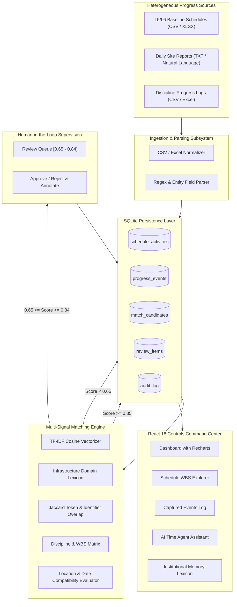

# Intelligent Data Capture & Schedule-Linking Layer (SIH26122)

> **Hackathon Prototype** for automated capture of heterogeneous infrastructure execution events and intelligent linking to L5/L6 project schedule activities.

---

## 1. System Architecture

---

## 2. Multi-Signal Matching Policy & Weights

The matching engine fuses five distinct signals to calculate a deterministic confidence score:

$$\text{Confidence} = 0.40 \cdot S_{\text{desc}} + 0.20 \cdot S_{\text{discipline}} + 0.15 \cdot S_{\text{identifier/token}} + 0.15 \cdot S_{\text{location}} + 0.10 \cdot S_{\text{date}}$$

### Confidence Decision Policy:
1. **High Confidence ($\ge 0.85$)**: Automatically linked to L5/L6 activity.
2. **Medium Confidence ($0.65 - 0.84$)**: Routed to Human-in-the-Loop Review Queue with explanatory breakdown.
3. **Low Confidence ($< 0.65$)**: Retained as an unmatched event / potential new scope item (never discarded).

---

## 3. Core Database Entities

| Entity | Primary Key | Key Attributes | Purpose |
|---|---|---|---|
| `ScheduleActivity` | `activity_id` | `wbs`, `discipline`, `description`, `planned_start`, `planned_finish`, `location`, `status` | Baseline L5/L6 project activities |
| `ProgressEvent` | `event_id` | `source_document`, `discipline`, `raw_text`, `normalized_description`, `actual_start`, `actual_finish`, `activity_id`, `confidence`, `status` | Extracted site execution events |
| `MatchCandidate` | `match_id` | `event_id`, `activity_id`, `similarity_score`, `confidence_score`, `explanation`, `status` | Computed match evaluations |
| `ReviewItem` | `review_id` | `event_id`, `match_id`, `confidence`, `status`, `reviewer_notes` | HITL review queue |
| `AuditLog` | `audit_id` | `action`, `entity_type`, `entity_id`, `details`, `user`, `timestamp` | Full provenance & audit trail |

---

## 4. API Specification

- `GET /health` — Service health & mode inspection
- `POST /api/v1/schedule/upload` — Upload CSV/XLSX schedule
- `GET /api/v1/schedule/activities` — Retrieve baseline activities
- `POST /api/v1/progress/upload` — Upload daily reports / CSVs
- `POST /api/v1/progress/parse` — Preview parse without storing
- `POST /api/v1/matching/run` — Execute multi-signal matching
- `GET /api/v1/matching/review` — Fetch pending review items
- `POST /api/v1/matching/{id}/approve` — Approve match candidate
- `POST /api/v1/matching/{id}/reject` — Reject match candidate
- `GET /api/v1/progress` — Query progress events
- `GET /api/v1/dashboard` — Live aggregated dashboard metrics
- `GET /api/v1/audit` — Audit trail
- `POST /api/v1/agent/query` — AI Time Agent queries
- `GET /api/v1/memory` — Institutional memory & lexicon
