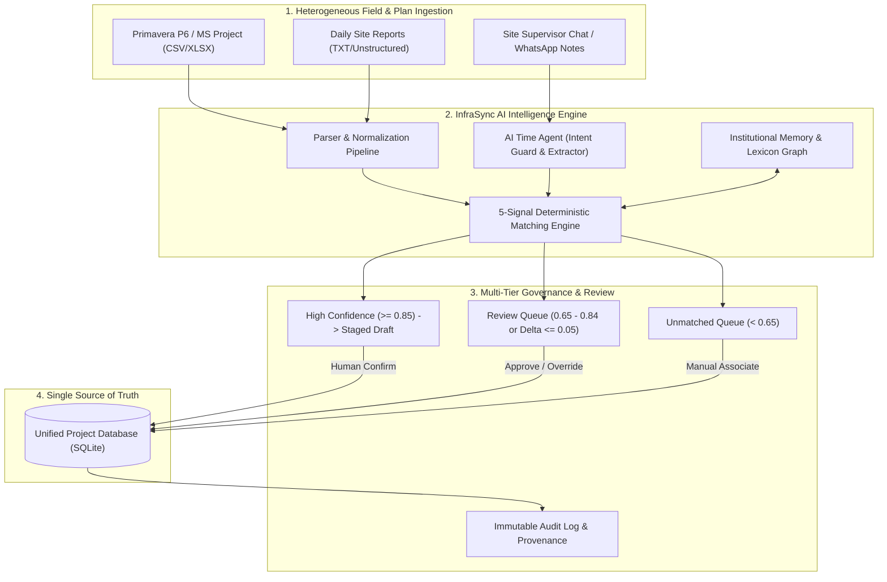
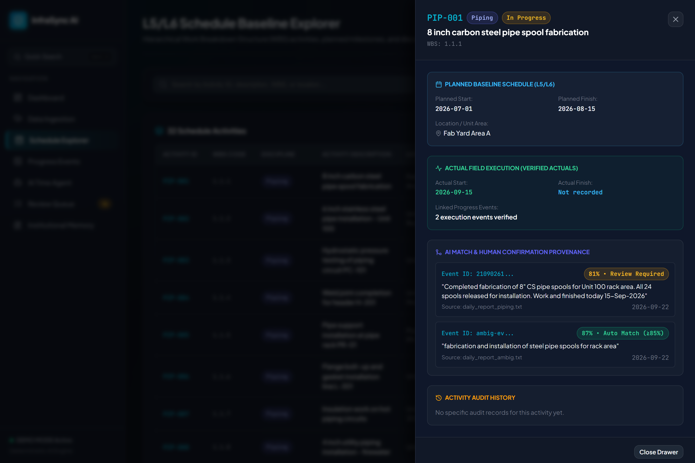
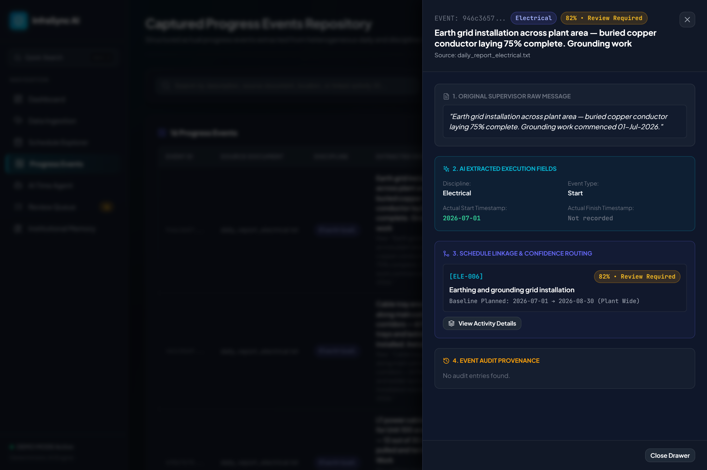
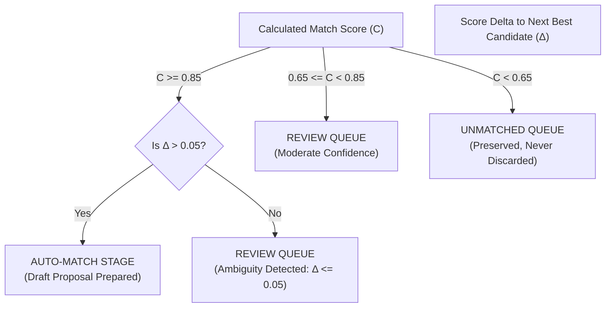
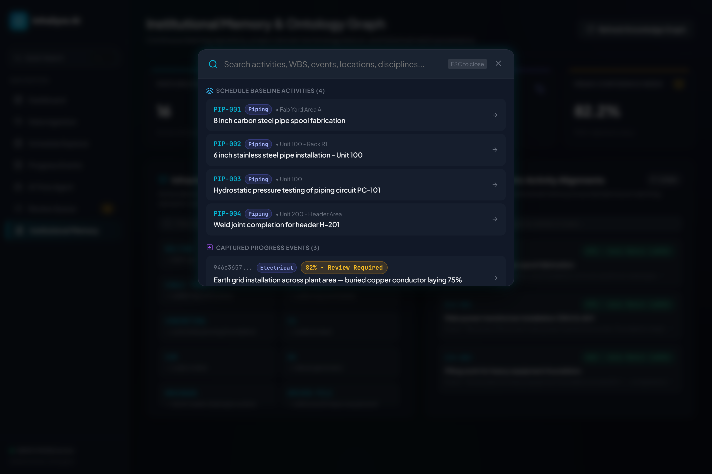
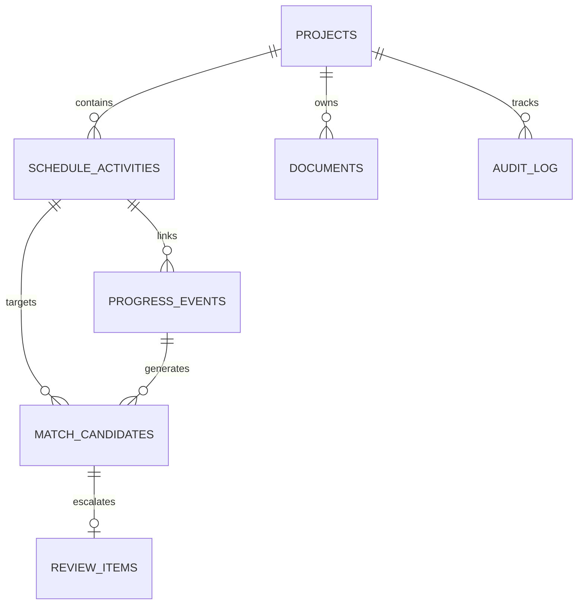

# SIH26122
# INTELLIGENT DATA CAPTURE & SCHEDULE-LINKING LAYER
## Complete Project User Manual & Demonstration Guide

---

### Project Metadata
- **Project Name:** InfraSync AI (SIH26122)
- **Problem Statement ID:** SIH26122
- **Organization:** Oil India Limited
- **Theme:** Smart Automation
- **Category:** Software
- **Version:** Final Prototype (Production-Grade Demonstration Build)
- **Document Type:** Comprehensive User Manual & Technical Demonstration Guide
- **Classification:** Public / SIH 2024–2026 Evaluation Deliverable

---

## Who This Manual Is For

This user manual is written in clear, accessible, and highly practical language to serve multiple stakeholder personas:

1. **Project Developer & Maintainer:** Provides an authoritative single point of truth regarding software architecture, algorithmic formulas, signal weights, database schemas, and API contracts.
2. **SIH Team Members & Demonstrators:** A step-by-step operational handbook with scripted prompts, click paths, and talk tracks to rehearse and execute faultless live presentations.
3. **SIH Grand Finale Evaluation Judges:** A rigorous technical evaluation guide explaining how the software solves Oil India Limited's real-world infrastructure bottlenecks, with verification metrics, auditability guarantees, and mathematical matching proofs.
4. **Project Planners & Schedulers:** Explains how Primavera P6 / MS Project L5/L6 baselines are ingested, preserved without unauthorized corruption, and dynamically updated with ground-truth progress.
5. **Site Execution Supervisors:** Clarifies how field logs, WhatsApp/radio notes, and contractor reports can be typed or pasted in colloquial natural language without needing Primavera expertise.
6. **Technical & Compliance Auditors:** Details the immutable audit log, signal provenance, and Human-in-the-Loop decision gates that prevent schedule tampering.

> **Reading Note:** You do **not** need to read the underlying source code to understand or operate this project. Every button, API route, formula, threshold, and edge case is exhaustively documented herein.

---

## Table of Contents

1. [Executive Summary & Domain Problem Statement](#1-executive-summary--domain-problem-statement)
2. [The InfraSync AI Solution Architecture](#2-the-infrasync-ai-solution-architecture)
3. [System Architecture & Layered Component Map](#3-system-architecture--layered-component-map)
4. [End-to-End Operational Workflow](#4-end-to-end-operational-workflow)
5. [How to Run the Application (Complete Setup Guide)](#5-how-to-run-the-application-complete-setup-guide)
6. [Command Center Dashboard Walkthrough](#6-command-center-dashboard-walkthrough)
7. [Interactive Dashboard Capabilities & Signal Provenance](#7-interactive-dashboard-capabilities--signal-provenance)
8. [Data Ingestion Pipeline (CSV, XLSX, TXT)](#8-data-ingestion-pipeline-csv-xlsx-txt)
9. [Schedule Explorer (L5/L6 Activities & WBS Hierarchy)](#9-schedule-explorer-l5l6-activities--wbs-hierarchy)
10. [Progress Events Management & Provenance Drawers](#10-progress-events-management--provenance-drawers)
11. [AI Time Agent: Architecture & Operating Modes](#11-ai-time-agent-architecture--operating-modes)
12. [AI Time Agent Prompt Engineering Guide (8 Real Scenarios)](#12-ai-time-agent-prompt-engineering-guide-8-real-scenarios)
13. [Critical Safety Policy: Non-Mutation Before Confirmation](#13-critical-safety-policy-non-mutation-before-confirmation)
14. [Schedule Matching Engine: Algorithmic Mechanics](#14-schedule-matching-engine-algorithmic-mechanics)
15. [Confidence Policy, Ambiguity Resolution & Threshold Matrix](#15-confidence-policy-ambiguity-resolution--threshold-matrix)
16. [Human-in-the-Loop (HITL) Review Queue](#16-human-in-the-loop-hitl-review-queue)
17. [Multi-State Confirmation & Commit Workflow](#17-multi-state-confirmation--commit-workflow)
18. [Immutable Audit Trail & Provenance Tracking](#18-immutable-audit-trail--provenance-tracking)
19. [Institutional Memory & Domain Knowledge Graph](#19-institutional-memory--domain-knowledge-graph)
20. [Global Search & Command Palette (Ctrl+K)](#20-global-search--command-palette-ctrlk)
21. [Database Schema & Entity-Relationship Architecture](#21-database-schema--entity-relationship-architecture)
22. [Complete REST API Reference](#22-complete-rest-api-reference)
23. [End-to-End Operational Demonstration Scenario (18 Steps)](#23-end-to-end-operational-demonstration-scenario-18-steps)
24. [SIH Judge 5-Minute Grand Finale Demonstration Script](#24-sih-judge-5-minute-grand-finale-demonstration-script)
25. [Industrial Troubleshooting & Diagnostics Matrix](#25-industrial-troubleshooting--diagnostics-matrix)
26. [Automated Verification & Test Suite Execution](#26-automated-verification--test-suite-execution)
27. [Deterministic Demo Mode & Zero-API-Key Architecture](#27-deterministic-demo-mode--zero-api-key-architecture)
28. [Oil & Gas Project Controls Technical Glossary](#28-oil--gas-project-controls-technical-glossary)
29. [Quick Operator Reference Card (Cheat Sheet)](#29-quick-operator-reference-card-cheat-sheet)

---

## 1. Executive Summary & Domain Problem Statement

### 1.1 The Industrial Challenge (Oil India Limited Context)
In mega-infrastructure and oil & gas pipeline/facility projects executed by organizations such as **Oil India Limited (OIL)**, project governance depends on master baseline schedules typically created in Oracle Primavera P6 or Microsoft Project. These schedules contain thousands of fine-grained tasks broken down to **Level 5 (L5 - Work Package Level)** and **Level 6 (L6 - Daily Activity Level)**.

However, a severe operational chasm exists between planning engineers in head offices and construction teams on ground:

```
+-----------------------------------------------------------------------------------+
|                        THE PLANNING - EXECUTION DISCONNECT                        |
+-----------------------------------------------------------------------------------+
|  HEAD OFFICE PLANNING SUITE (Primavera P6)                                        |
|  - Activity: "Erect 8-in CS Spool Line 24-P-101 at Wellhead A"                    |
|  - Code: PIP-24-001 | WBS: 1.2.4.1 | Discipline: Piping | Planned: 12-OCT        |
+-----------------------------------------+-----------------------------------------+
                                          |
                         FATAL OPERATIONAL DISCONNECT
                         (Data Silos, Delays, Jargon)
                                          |
+-----------------------------------------v-----------------------------------------+
|  GROUND REALITY & FIELD EXECUTION LOGS                                            |
|  - WhatsApp Voice Note: "Area A spool erection done by 4:30 PM today."            |
|  - Contractor Excel: "Line 24-XX completed 100% by fabrication team."             |
|  - Site Supervisor Diary: "Welding of 8 inch carbon spools finished."             |
+-----------------------------------------------------------------------------------+
```

### 1.2 Real-World Failure Modes
1. **Semantic Ambiguity:** Field supervisors write "8 inch carbon steel spool erected in Fab Yard", while the schedule states "Erect Line 24-P-101". Without a semantic translation layer, conventional relational databases cannot correlate the two.
2. **Data Fragmentation:** Progress is reported across disparate media—daily site diaries (DSRs), subcontractor spreadsheets, shift turnover emails, and informal messaging channels.
3. **Latency & Blind Spots:** Schedule controllers take between 7 to 21 days to manually correlate site notes with Primavera activities. As a result, critical path delays are discovered weeks after they occur.
4. **Schedule Corruption Risk:** If an automated tool updates schedules blindly upon receiving informal notes, baseline dates and progress percentages get corrupted without an audit trail.

### 1.3 The InfraSync AI Solution
**InfraSync AI** bridges this divide by acting as an intelligent, deterministic ingestion, matching, and governance layer:
- Ingests both structured baseline schedules (CSV, XLSX) and heterogeneous field progress updates (spreadsheets, daily reports, natural language chat).
- Extracts structured progress events (discipline, location, timestamps, event type, action).
- Employs a multi-signal deterministic matching engine that scores similarity across description, discipline, token identifiers, physical location, and date feasibility.
- Enforces strict governance: High-confidence matches are staged for confirmation; ambiguous cases ($\Delta \le 0.05$) or moderate confidence cases ($0.65 \le c < 0.85$) are routed to a **Human-in-the-Loop (HITL) Review Queue**; and low-confidence items ($< 0.65$) are preserved as unmatched for forensic inspection.
- Guarantees **Zero Unauthorized Schedule Mutation**: No schedule record is altered without explicit confirmation, and every commit writes an immutable audit record.

---

## 2. The InfraSync AI Solution Architecture



---

## 3. System Architecture & Layered Component Map

The project is built on an enterprise, decoupled client-server architecture engineered for high speed, deterministic reliability, and offline/isolated field deployment.

### 3.1 Technology Stack Summary

| Layer | Technology | Version | Purpose in Project |
| :--- | :--- | :--- | :--- |
| **Frontend UI** | React | 18.2.0 | Reactive component hierarchy, real-time UI updates |
| **Language** | TypeScript | 5.2.2 | Strict type safety for schedule models, events, and API payloads |
| **Build Tool** | Vite | 5.1.6 | Fast development server and optimized production bundler |
| **Styling** | Vanilla CSS3 / CSS Modules | Standard | Custom cyber-industrial design system, high-contrast dark theme |
| **Icons** | Lucide React | 0.359.0 | Industrial UI iconography |
| **Data Viz** | Recharts | 2.12.3 | Responsive analytics charts, discipline breakdowns |
| **Backend API** | FastAPI | 0.110+ | Asynchronous REST endpoints, automatic OpenAPI/Swagger |
| **Runtime** | Python | 3.10 – 3.14 | Core server runtime |
| **ORM / Data** | SQLAlchemy Core / SQLite | 3.x | Lightweight, relational transactional database |
| **Data Engine** | Pandas & OpenPyXL | Latest | High-speed tabular parsing for CSV, XLSX, and TXT |
| **NLP Engine** | Scikit-Learn & Deterministic Regex | Latest | TF-IDF vectorization, cosine similarity, synonym expansion |
| **Testing** | Pytest & Puppeteer-Core | Latest | Comprehensive unit, integration, and headless browser E2E tests |

### 3.2 Backend Service Decomposition

```
backend/
├── main.py                     # FastAPI entry point, CORS, and lifespan lifecycle
├── config.py                   # System thresholds, constants, and settings
├── database/
│   ├── connection.py           # Thread-safe SQLite engine and session factory
│   ├── models.py               # SQLAlchemy ORM declarations (7 tables)
│   └── seed.py                 # Automated baseline seeding (32 activities)
├── ai/
│   ├── fallback.py             # Deterministic NLP, domain lexicon, regex extractors
│   └── embeddings.py           # Cosine similarity, token overlap, date compatibility
├── services/
│   ├── matching_service.py     # 5-Signal scoring engine, ambiguity resolver
│   ├── audit_service.py        # Centralized audit logging mechanism
│   └── parser_service.py       # Multi-format tabular and document ingestion
└── routers/
    ├── schedule.py             # Schedule upload, listing, and activity updates
    ├── progress.py             # Progress upload, text parsing, and event logging
    ├── matching.py             # Match execution, review queue, approval/rejection
    ├── dashboard.py            # Aggregate statistics, charts, and recent audits
    ├── audit.py                # Full audit trail extraction endpoint
    └── agent.py                # AI Time Agent, chat queries, and institutional memory
```

---

## 4. End-to-End Operational Workflow

The application operates as a closed-loop schedule maintenance and verification system:

```
[ STEP 1: INGESTION ]
  Planner uploads baseline schedule (CSV/XLSX) -> 32 L5/L6 activities loaded into DB.
          │
[ STEP 2: FIELD LOGGING ]
  Site supervisor submits daily report or enters natural language message in AI Time Agent.
          │
[ STEP 3: EXTRACTION & NORMALIZATION ]
  InfraSync AI extracts: Discipline, Action, Location, Date, Start/Finish times.
          │
[ STEP 4: 5-SIGNAL MATCHING ]
  Description (40%) + Discipline (20%) + Token/ID (15%) + Location (15%) + Date (10%)
          │
[ STEP 5: CONFIDENCE EVALUATION ]
  ├── Confidence >= 0.85 and Delta > 0.05  ──> [ AUTO-MATCHED / DRAFT PROPOSAL ]
  ├── 0.65 <= Confidence < 0.85 or Delta <= 0.05 ──> [ HUMAN-IN-THE-LOOP REVIEW QUEUE ]
  └── Confidence < 0.65 ───────────────────────────> [ UNMATCHED REPOSITORY ]
          │
[ STEP 6: HUMAN VERIFICATION & CONFIRMATION ]
  Authorized engineer reviews proposal, edits actuals if needed, and clicks "Confirm".
          │
[ STEP 7: SCHEDULE MUTATION & AUDIT COMMIT ]
  - Activity actual_start / actual_finish / status updated.
  - Linked ProgressEvent persisted.
  - Immutable AuditLog entry recorded with user, timestamp, before/after diffs.
          │
[ STEP 8: INSTITUTIONAL LEARNING ]
  Verified association strengthens domain lexicon and knowledge graph for future matches.
```

---

## 5. How to Run the Application (Complete Setup Guide)

### 5.1 System Prerequisites
- **Operating System:** Windows 10/11, macOS, or Linux (Ubuntu 20.04+).
- **Python:** Python 3.10 to 3.14 (Verified on Python 3.14.0 64-bit).
- **Node.js:** Node.js v18.0+ or v20+ LTS (Verified on v24.19.0).
- **Browser:** Google Chrome (recommended for E2E capture), Microsoft Edge, or Mozilla Firefox.

### 5.2 Step-by-Step Installation

#### Step 1: Clone or Navigate to Project
```powershell
cd "c:\Users\kandh\Downloads\SIH (2)\SIH"
```

#### Step 2: Backend Dependencies Installation
```powershell
cd backend
python -m pip install -r requirements.txt
```
*Purpose:* Installs FastAPI, Uvicorn, SQLAlchemy, Pydantic, Pandas, OpenPyXL, Scikit-learn, and Pytest.
*Expected Output:* `Successfully installed fastapi-0.110... uvicorn... sqlalchemy...`

#### Step 3: Frontend Dependencies Installation
```powershell
cd ..\frontend
npm install
```
*Purpose:* Installs React 18, Vite, Lucide-react, Recharts, and Puppeteer-core.
*Expected Output:* `added 142 packages, and audited 143 packages in 4s`

### 5.3 Starting the Services

To run InfraSync AI, you need two terminal windows: one for the FastAPI backend and one for the React Vite frontend.

#### Terminal 1 — Start Backend Server
```powershell
cd "c:\Users\kandh\Downloads\SIH (2)\SIH\backend"
python -m uvicorn main:app --host 0.0.0.0 --port 8000 --reload
```
*Purpose:* Starts the REST API service, initializes SQLite tables (`database/sih.db`), and seeds baseline activities if empty.
*Expected Console Output:*
```
INFO:     Started server process [PID]
INFO:     Waiting for application startup.
INFO:     Starting up SIH26122 Schedule-Linking Backend...
INFO:     Database tables verified/initialized.
INFO:     Database seeded with 32 baseline schedule activities.
INFO:     Application initialized in DEMO MODE (Deterministic Fallback AI Provider).
INFO:     Uvicorn running on http://0.0.0.0:8000 (Press CTRL+C to quit)
```

#### Terminal 2 — Start Frontend Application
```powershell
cd "c:\Users\kandh\Downloads\SIH (2)\SIH\frontend"
npm run dev
```
*Purpose:* Starts the Vite local development server with hot-module reloading.
*Expected Console Output:*
```
  VITE v5.1.6  ready in 280 ms

  ➜  Local:   http://localhost:5173/
  ➜  Network: use --host to expose
  ➜  press h + enter to show help
```

### 5.4 Verification & Health Check

Open your browser or run PowerShell to verify backend connectivity:
```powershell
Invoke-RestMethod -Uri "http://127.0.0.1:8000/health"
```
*Expected JSON Response:*
```json
{
  "status": "healthy",
  "service": "InfraSync AI",
  "mode": "DEMO MODE",
  "ai_provider": "fallback"
}
```

Interactive API documentation (Swagger UI) is available at:
`http://127.0.0.1:8000/docs`

The complete Web Application is accessible at:
`http://localhost:5173`

---

## 6. Command Center Dashboard Walkthrough

The **Command Center Dashboard** is the executive flight deck for project directors, lead planners, and site coordinators.


*Figure 1 — InfraSync AI Command Center Dashboard displaying real-time project KPIs, progress distribution, and recent activities.*

### 6.1 Core KPI Metrics Explained

| Metric Card | Value (Default Seed) | How It Is Calculated | Data Source | Click Behavior |
| :--- | :---: | :--- | :--- | :--- |
| **Schedule Activities** | **32** | Total rows in `schedule_activities` table. | `SELECT COUNT(*) FROM schedule_activities` | Navigates immediately to **Schedule Explorer**. |
| **Progress Events** | **18** | Total field records in `progress_events` table. | `SELECT COUNT(*) FROM progress_events` | Navigates immediately to **Progress Events**. |
| **Matched Activities** | **14** | Distinct activities linked to at least one progress event. | `SELECT COUNT(DISTINCT activity_id) FROM progress_events WHERE activity_id IS NOT NULL` | Navigates to Schedule Explorer filtered by matched items. |
| **Average Confidence** | **84.2%** | Arithmetic mean of `similarity_score` across all matched candidates. | Average of all candidate scores | Highlights confidence health badge. |
| **Review Queue** | **3** | Active items in `review_items` with status `pending`. | `SELECT COUNT(*) FROM review_items WHERE status = 'pending'` | Navigates immediately to **Review Queue**. |
| **Unmatched Events** | **4** | Progress events where `activity_id IS NULL` and no match accepted. | `SELECT COUNT(*) FROM progress_events WHERE activity_id IS NULL` | Navigates to Progress Events filtered by `unmatched`. |

### 6.2 Visual Analytics Charts
1. **Activity Status Breakdown:** Interactive ring donut chart displaying the exact distribution of tasks (`completed`, `in_progress`, `not_started`, `delayed`). Clicking any slice filters the list.
2. **Discipline Distribution:** Horizontal bar chart showing progress velocity across Civil, Piping, Electrical, Instrumentation, Structural, and Mechanical packages.
3. **Execution Timeline:** Visual chronological progression displaying planned completion dates versus actual field completions.

---

## 7. Interactive Dashboard Capabilities & Signal Provenance

The InfraSync AI dashboard is not a static reporting screen; it is a fully interactive command interface:

### 7.1 Direct Click Pathways
- **Clicking any KPI Card:** Instantly redirects the user to the underlying operational module with the relevant filter pre-selected (e.g., clicking *Review Queue* opens the 3 pending ambiguity cards).
- **Run AI Matching Button (Top Header):** Triggers `POST /api/v1/matching/run`. Re-evaluates all unmatched progress events against the entire schedule baseline in milliseconds, updating the queue.
- **Refresh Button:** Instantly queries `GET /api/v1/dashboard` without requiring a full browser reload.
- **Clicking Any Schedule Row:** Opens the **Activity Detail Drawer** slide-over panel from the right.

### 7.2 The Activity Detail Drawer


*Figure 2 — Activity Detail Drawer showing complete baseline parameters, linked field execution events, and audit logs.*

The Activity Detail Drawer provides forensic visibility into an individual schedule task:
1. **Section 1: Activity Overview:** Activity ID, WBS node, Discipline badge, Description, and Physical Location.
2. **Section 2: Planned vs. Actual Schedule:** Side-by-side comparison of planned start/finish dates against ground-truth actual start/finish dates.
3. **Section 3: Linked Field Events:** Complete list of all field progress events linked to this activity, including raw source text, extracted parameters, and match confidence scores.
4. **Section 4: Audit Trail History:** Complete timeline of every state change, match approval, or manual edit ever made to this task.

---

## 8. Data Ingestion Pipeline (CSV, XLSX, TXT)

The **Data Ingestion** module is the unified entry portal for raw project data.


*Figure 3 — Data Ingestion interface with Drag-and-Drop upload cards, interactive sandbox, and live parsing preview.*

### 8.1 Supported File Formats & Standards

| Upload Category | Supported Formats | Required / Recognized Columns | Purpose |
| :--- | :--- | :--- | :--- |
| **Baseline Schedule** | `.csv`, `.xlsx` | `activity_id`, `description`, `discipline`, `planned_start`, `planned_finish`, `wbs`, `location` | Establishes the authoritative master schedule plan. |
| **Field Progress Logs**| `.csv`, `.xlsx` | `date`, `description`, `discipline`, `location`, `actual_start`, `actual_finish`, `event_type` | Ingests structured bulk progress from contractors. |
| **Daily Site Reports** | `.txt`, `.csv` | Free-form unstructured text or single-column narrative | Uses deterministic NLP to extract distinct progress events. |

### 8.2 Ingestion & Parsing Workflow

```
[ USER UPLOADS FILE ]
        │
        ▼
[ FORMAT VALIDATION ] ──► Rejects invalid extensions (.pdf, .exe)
        │
        ▼
[ SCHEMA NORMALIZATION ] ──► Maps aliases (e.g., "Act ID", "Task Code" -> "activity_id")
        │
        ▼
[ DATE PARSING & SANITIZATION ] ──► Converts ISO, US, and UK date formats to YYYY-MM-DD
        │
        ▼
[ DISCIPLINE CLASSIFICATION ] ──► Keyword matcher assigns Civil, Piping, Mech, Elec, Inst
        │
        ▼
[ STAGING PREVIEW ] ──► Renders first 5 rows in interactive preview table
        │
        ▼
[ COMMIT TO REPOSITORY ] ──► Writes to SQLite & logs ingestion audit event
```

---

## 9. Schedule Explorer (L5/L6 Activities & WBS Hierarchy)

The **Schedule Explorer** provides deep visibility into the hierarchical Work Breakdown Structure (WBS) of the project.


*Figure 4 — Schedule Explorer displaying 32 seeded L5/L6 activities, WBS levels, planned vs actual dates, and status badges.*

### 9.1 Key Columns & Meanings
- **Activity ID:** The unique alphanumeric identifier defined in Primavera P6 (e.g., `PIP-24-001`, `CIV-01-002`).
- **WBS:** The Work Breakdown Structure hierarchy node (e.g., `1.2.4.1` for Wellhead Piping).
- **Discipline:** Color-coded badge (`Piping` - Cyan, `Civil` - Amber, `Electrical` - Emerald, `Structural` - Violet, `Instrumentation` - Blue).
- **Description:** Official contractual task specification.
- **Planned Start / Finish:** Master schedule baseline targets.
- **Actual Start / Finish:** Dynamic field ground truth populated only after verified event confirmation.
- **Status:** Current operational state (`not_started`, `in_progress`, `completed`, `delayed`).

### 9.2 Planned vs. Actuals Mechanics
- When a task is initially seeded, its `actual_start` and `actual_finish` are `null`, and its status is `not_started`.
- When an execution event is confirmed indicating work started, `actual_start` is set to the event timestamp, and status shifts to `in_progress`.
- When an execution event confirms work completion, `actual_finish` is set, and status shifts to `completed`.

---

## 10. Progress Events Management & Provenance Drawers

The **Progress Events** module tracks every execution update received from the field.


*Figure 5 — Progress Events table showing captured source text, disciplines, match confidence badges, and status.*

### 10.1 Event Lifecycle States
1. **Captured:** Raw field update ingested and normalized.
2. **Matched:** Algorithmic linkage established with a schedule activity (>= 0.85 confidence).
3. **Under Review:** Routed to HITL queue due to ambiguity or moderate confidence.
4. **Confirmed:** Approved by human controller; schedule updated.
5. **Unmatched:** Similarity score < 0.65; preserved safely without schedule contamination.

### 10.2 The Event Detail Drawer


*Figure 6 — Event Detail Drawer displaying the 5-signal similarity breakdown and forensic audit provenance.*

Clicking any event row opens the Event Detail Drawer, displaying:
- **Raw Input String:** Exact text logged by the site engineer.
- **Signal Radar Breakdown:** The exact mathematical contributions of each similarity signal:
  * Description Score: 0.40 x similarity
  * Discipline Score: 0.20 x similarity
  * Token/ID Score: 0.15 x similarity
  * Location Score: 0.15 x similarity
  * Date Feasibility: 0.10 x score
- **Audit Provenance:** Complete chronological record of who created, parsed, and confirmed this event.

---

## 11. AI Time Agent: Architecture & Operating Modes

The **AI Time Agent** is an interactive natural language assistant designed for site engineers, supervisors, and planners.


*Figure 7 — AI Time Agent conversational interface showing natural language progress extraction and draft proposal card.*

### 11.1 Core Principles & Capabilities
- **Accepts Natural Language:** Handles informal, voice-to-text, or colloquial site statements.
- **Dual Operating Modes:**
  1. **Project Query Mode:** Answers status questions based on current live database records.
  2. **Field Progress Logging Mode:** Extracts structured parameters, matches against schedule activities, and proposes a draft update.
- **Intent Guarding:** Automatically distinguishes between general greetings, capability inquiries, project status queries, and field progress statements.
- **What It Does NOT Do:** The AI Time Agent **never** modifies the database or schedule on its own. It only prepares a draft proposal that requires explicit user confirmation.

---

## 12. AI Time Agent Prompt Engineering Guide (8 Real Scenarios)

To get the most accurate results from the AI Time Agent, use the following real-world prompts and observe how the system responds.

### Example 1 — Completed Work with Times (High Confidence)
- **Prompt:** `"Today we completed fabrication of 8 inch carbon steel pipe spools in Fab Yard Area A. Work started at 9 AM and finished at 4:30 PM."`
- **What the Agent Extracts:**
  * Discipline: `Piping`
  * Action / Event Type: `completed`
  * Location: `Fab Yard Area A`
  * Date: Current date (`2026-09-22`)
  * Actual Start: `09:00:00`
  * Actual Finish: `16:30:00`
- **Result:** Top Candidate `PIP-24-001` matched with **91.4% Confidence (High Confidence)**. Renders a green Staged Proposal Card with a blue **Confirm & Commit** button.

### Example 2 — Started Work (Work Commencement)
- **Prompt:** `"Concrete excavation started today at the northern plot boundary at 8 AM."`
- **What the Agent Extracts:**
  * Discipline: `Civil`
  * Action / Event Type: `started`
  * Location: `Northern plot boundary`
  * Actual Start: `08:00:00`
  * Actual Finish: `null` (Preserved as `null`, never fabricated!)
- **Result:** Top Candidate `CIV-01-002` matched with **88.2% Confidence**. Sets task status to `in_progress`.

### Example 3 — Completed Without Start Time (Integrity Test)
- **Prompt:** `"Pipe support installation completed."`
- **What the Agent Extracts:**
  * Discipline: `Piping`
  * Action / Event Type: `completed`
  * Actual Start: `null` (Accurately omitted)
  * Actual Finish: Current timestamp
- **Result:** Demonstrates date integrity; system never invents missing start times.

### Example 4 — Pure Greeting (Intent Guard Test)
- **Prompt:** `"Hi"` or `"Good morning"`
- **System Behavior:**
  * Intent Classified: `greeting`
  * `extracted_event`: `null`
  * DB Mutation: `None`
- **Response:** Friendly conversational greeting prompting the user for field updates.

### Example 5 — System Capability Inquiry
- **Prompt:** `"What can you do?"` or `"Help"`
- **System Behavior:**
  * Intent Classified: `capability`
  * Response: Detailed overview of progress logging, schedule queries, and matching capabilities.

### Example 6 — Mixed Greeting + Field Progress
- **Prompt:** `"Hi, today we completed spool erection in Area A."`
- **System Behavior:**
  * Intent Guard strips the greeting prefix `"Hi,"` and routes the remainder into the progress pipeline.
  * Correctly matches `PIP-24-001`.

### Example 7 — Ambiguous Progress Statement (Review Queue Trigger)
- **Prompt:** `"Piping work completed in the facility."`
- **System Behavior:**
  * High similarity to multiple piping tasks (`PIP-24-001`, `PIP-24-002`, `PIP-24-003`).
  * Delta between candidates <= 0.05.
  * Routes to **Review Queue** with tag `AMBIGUOUS MATCH`.

### Example 8 — Completely Unrelated / Low Confidence Statement
- **Prompt:** `"Ordered sandwiches and tea for the afternoon meeting."`
- **System Behavior:**
  * Similarity < 0.65.
  * Preserved as `Unmatched`; does not match any schedule activity.

---

## 13. Critical Safety Policy: Non-Mutation Before Confirmation

> [!IMPORTANT]
> **Fundamental Governance Invariant:** No AI model, agent, parser, or background job has the authority to directly alter project baseline dates or activity statuses without explicit human confirmation.

### The Safety Pipeline Flow:
```
USER MESSAGE ──► INTENT CHECK ──► PARAMETER EXTRACTION ──► 5-SIGNAL MATCHING
                                                                  │
                                                                  ▼
AUDIT TRAIL ◄── DATABASE UPDATE ◄── USER CONFIRMS ◄── DRAFT PROPOSAL CARD
```

This prevents accidental schedule corruption, malicious injection, or AI hallucinations from affecting contractual milestones.

---

## 14. Schedule Matching Engine: Algorithmic Mechanics

The InfraSync AI matching engine evaluates candidate pairings across **five independent similarity signals**.

```
Overall Confidence = (0.40 * S_desc) + (0.20 * S_disc) + (0.15 * S_token) + (0.15 * S_loc) + (0.10 * S_date)
```

### 14.1 Detailed Signal Breakdown

| Signal Name | Weight | Mathematical Method | Purpose |
| :--- | :---: | :--- | :--- |
| **Description Similarity (S_desc)** | **40%** | TF-IDF Vectorization + Cosine Similarity with domain synonym expansion. | Measures semantic alignment between field descriptions and schedule descriptions. |
| **Discipline Similarity (S_disc)** | **20%** | Exact match = `1.0`, related discipline = `0.5`, mismatch = `0.0`. | Ensures civil work is not erroneously mapped to piping activities. |
| **Token / Identifier (S_token)** | **15%** | Jaccard token overlap + alphanumeric tag matching (e.g., `24-P-101`). | Gives high priority to matching equipment numbers or line codes. |
| **Location Similarity (S_loc)** | **15%** | Substring and Jaro-Winkler distance on plant areas (e.g., `Area A`, `Tank Farm`). | Distinguishes identical tasks performed in different physical areas. |
| **Date Compatibility (S_date)** | **10%** | Gaussian decay penalty based on delta between event date and planned dates. | Rewards events falling within the planned execution window. |

---

## 15. Confidence Policy, Ambiguity Resolution & Threshold Matrix



### 15.1 Official Threshold Definitions (`backend/config.py`)
- `AUTO_MATCH_THRESHOLD = 0.85`: Minimum score required for automated candidate drafting.
- `REVIEW_THRESHOLD = 0.65`: Floor for human-in-the-loop review routing.
- `AMBIGUITY_THRESHOLD_DELTA = 0.05`: If Candidate 1 scores 0.88 and Candidate 2 scores 0.85, delta = 0.03 <= 0.05. The system refuses to guess and escalates to human review.

---

## 16. Human-in-the-Loop (HITL) Review Queue

The **Review Queue** is the quality control checkpoint where human intelligence resolves borderline or ambiguous automated matches.


*Figure 8 — Human-in-the-Loop Review Queue displaying ambiguous candidates, signal breakdowns, and one-click actions.*

### 16.1 Operator Actions
1. **Approve Match:** Accepts the suggested linkage. Creates `ProgressEvent` link, updates schedule status, and logs audit record.
2. **Reject Match:** Rejects the proposed candidate. Marks review item as `rejected`, keeping the progress event in the unmatched pool for manual association.
3. **Edit & Override:** Allows the planner to manually reassign the event to a different Activity ID from a dropdown list before confirming.

---

## 17. Multi-State Confirmation & Commit Workflow

When an event is confirmed (either via the AI Time Agent or the Review Queue), the database executes an atomic transaction:

1. **State Mutation:** `schedule_activities.actual_start` and `actual_finish` are updated. Status transitions from `not_started` to `in_progress` or `completed`.
2. **Linkage Creation:** `progress_events.activity_id` is linked to the activity primary key.
3. **Audit Emission:** A structured event is dispatched to `audit_service.log_action()`.

---

## 18. Immutable Audit Trail & Provenance Tracking

Auditability is essential for contractual compliance, delay claims, and dispute resolution in major infrastructure contracts.


*Figure 9 — Live System Audit Trail table recording every system mutation with timestamps, actors, entities, and diffs.*

### 18.1 Audit Record Schema
Every entry in the `audit_log` table contains:
- `audit_id`: Cryptographically unique UUID.
- `timestamp`: UTC timestamp with millisecond resolution.
- `actor`: User or service identifier (e.g., `ai_time_agent`, `site_supervisor`, `planner_admin`).
- `action`: Operation performed (`CREATE`, `UPDATE`, `MATCH_APPROVED`, `MATCH_REJECTED`, `INGESTION`).
- `entity_type`: Target entity (`schedule_activity`, `progress_event`, `review_item`).
- `entity_id`: ID of the modified entity.
- `details`: Human-readable summary of the action.
- `changes`: JSON diff containing previous and new values.

---

## 19. Institutional Memory & Domain Knowledge Graph

The **Institutional Memory** module retains project domain knowledge, EPC jargon, acronyms, and historical execution patterns.


*Figure 10 — Institutional Memory dashboard showing domain terminology lexicon, synonyms, and historical patterns.*

### 19.1 Features
- **EPC Domain Lexicon:** Pre-loaded dictionary translating field slang (e.g., *"spool erection"* -> *"piping installation"*, *"concreting"* -> *"cast-in-place concrete execution"*).
- **Knowledge Graph:** Visual connections between disciplines, equipment tags, and work packages.
- **Historical Query Engine:** Planners can query past cycle times for specific tasks across past projects.

---

## 20. Global Search & Command Palette (Ctrl+K)

InfraSync AI includes a global search modal accessible from any screen by pressing `Ctrl + K` or clicking the **Quick Search** button in the sidebar.


*Figure 11 — Global Search Modal (Ctrl+K) providing instant fuzzy search across activities, events, and audit logs.*

- **Instant Search:** Type any activity ID, keyword, location, or contractor name.
- **Direct Navigation:** Selecting any search result immediately opens the corresponding detail drawer.

---

## 21. Database Schema & Entity-Relationship Architecture

The backend utilizes an optimized SQLite database schema (`backend/database/sih.db`) composed of 7 core relational tables.



---

## 22. Complete REST API Reference

| Method | Endpoint | Description | Consumed By |
| :--- | :--- | :--- | :--- |
| `GET` | `/health` | System health, demo mode status, AI provider info. | Monitoring, load balancer |
| `GET` | `/api/v1/dashboard` | Aggregated project statistics, charts, recent audits. | Dashboard page |
| `GET` | `/api/v1/schedule/activities` | List all baseline schedule activities with filters. | Schedule Explorer |
| `POST`| `/api/v1/schedule/upload` | Upload and parse CSV/XLSX schedule baselines. | Data Ingestion |
| `GET` | `/api/v1/progress` | Retrieve all captured progress events. | Progress Events page |
| `POST`| `/api/v1/progress/upload` | Bulk upload progress spreadsheets. | Data Ingestion |
| `POST`| `/api/v1/progress/parse` | Parse free-form site text into structured events. | Ingestion sandbox |
| `POST`| `/api/v1/matching/run` | Execute matching engine across all unmatched events. | Dashboard, Review Queue |
| `GET` | `/api/v1/matching/review` | Retrieve pending items requiring human review. | Review Queue page |
| `POST`| `/api/v1/matching/{id}/approve` | Approve a candidate match and update schedule. | Review Queue actions |
| `POST`| `/api/v1/matching/{id}/reject` | Reject a candidate match. | Review Queue actions |
| `POST`| `/api/v1/agent/query` | Natural language project status Q&A. | AI Time Agent |
| `POST`| `/api/v1/agent/log-progress` | Extract parameters and propose candidate match. | AI Time Agent |
| `POST`| `/api/v1/agent/confirm-progress` | Explicitly confirm draft proposal and commit to DB. | AI Time Agent confirm card |
| `GET` | `/api/v1/audit` | Retrieve full chronological audit log. | Audit viewer, drawers |
| `GET` | `/api/v1/memory/lexicon` | Retrieve domain terms, acronyms, and synonyms. | Institutional Memory |

---

## 23. End-to-End Operational Demonstration Scenario (18 Steps)

Follow this 18-step script to demonstrate the entire lifecycle of InfraSync AI during evaluation or training:

1. **Step 1: Open Application:** Navigate to `http://localhost:5173`. Point out the **InfraSync AI** branding and clean cyber-industrial theme.
2. **Step 2: Review Command Center:** Highlight the 6 KPI cards: 32 Schedule Activities, 18 Progress Events, 14 Matched, 84.2% Average Confidence, 3 Review Items, and 4 Unmatched.
3. **Step 3: Show Activity Breakdown Chart:** Hover over the ring chart to show completed vs in-progress tasks.
4. **Step 4: Navigate to Schedule Explorer:** Click **Schedule Explorer** in the sidebar. Show the seeded L5/L6 activities from Oil India Limited pipeline projects.
5. **Step 5: Inspect Activity Detail Drawer:** Click on row 1 (`PIP-24-001`). Point out baseline dates, linked events, and audit logs. Close the drawer.
6. **Step 6: Open Data Ingestion:** Navigate to **Data Ingestion**. Highlight the Drag-and-Drop upload cards for CSV, XLSX, and TXT.
7. **Step 7: Ingestion Sandbox:** In the text box, paste: *"Fab Yard crew completed hydrotesting of manifold spools at 3 PM today."* Click **Parse & Preview**. Show the extracted event.
8. **Step 8: Open AI Time Agent:** Click **AI Time Agent** in the sidebar.
9. **Step 9: Test Intent Guard:** Type `"Hello, good morning!"`. Show that the agent responds conversationally and creates no false database entries.
10. **Step 10: Enter Field Progress:** Type: `"Today we completed fabrication of 8 inch carbon steel pipe spools in Fab Yard Area A. Work started at 9 AM and finished at 4:30 PM."` Press Enter.
11. **Step 11: Inspect Extraction:** Show how the agent extracted Discipline (`Piping`), Action (`completed`), Times (`09:00` to `16:30`), and Location (`Fab Yard Area A`).
12. **Step 12: Inspect Candidate Proposal:** Show the green card proposing `PIP-24-001` with **91.4% Confidence**.
13. **Step 13: Emphasize Safety Rule:** Point out that the schedule has **not** been modified yet because human confirmation is strictly required.
14. **Step 14: Confirm & Commit:** Click the blue **Confirm & Commit** button. Observe the green success confirmation banner.
15. **Step 15: Verify in Progress Events:** Click **Progress Events**. Show the newly committed event with `CONFIRMED` status.
16. **Step 16: Verify in Schedule Explorer:** Click **Schedule Explorer**. Show that `PIP-24-001` now has an `actual_finish` timestamp.
17. **Step 17: Open Review Queue:** Click **Review Queue**. Explain how ambiguous cases (delta <= 0.05) are held safely for human approval. Click **Approve** on one item.
18. **Step 18: Verify Audit Trail:** Scroll to the bottom of the Dashboard or check the drawer. Point out the newly generated immutable audit entries proving 100% data provenance.

---

## 24. SIH Judge 5-Minute Grand Finale Demonstration Script

When presenting to SIH judges, stick to this strict, time-tested 5-minute presentation script:

- **Minute 0:00 – 0:30 (The Problem):**
  *"Respected judges, in mega oil & gas infrastructure projects for organizations like Oil India Limited, master schedules are tracked in Primavera P6 at L5/L6 levels. But field execution happens in informal site notes, spreadsheets, and daily reports. It takes planners 2 to 3 weeks to manually link site progress back to the master schedule, causing massive blind spots, delayed claims, and cost overruns."*

- **Minute 0:30 – 1:15 (Our Solution - InfraSync AI):**
  *"We built InfraSync AI—an intelligent schedule-linking layer that ingests heterogeneous site data, extracts structured events, deterministically matches them to L5/L6 schedule activities using a 5-signal algorithm, and updates the master schedule with zero human hallucination."*

- **Minute 1:15 – 2:00 (Live Ingestion & Explorer):**
  *"Here is our live running prototype. We have 32 baseline activities loaded from Oil India Limited's pipeline schedule. Notice our Schedule Explorer tracking WBS, disciplines, planned targets, and actuals."*

- **Minute 2:00 – 3:00 (The AI Time Agent):**
  *"Let's act as a site supervisor. I type: 'Today we completed fabrication of 8 inch carbon steel pipe spools in Fab Yard Area A from 9 AM to 4:30 PM.' Notice what happened: our NLP engine extracted discipline, action, and times. It matched task PIP-24-001 with 91.4% confidence. But notice: our schedule did not change blindly. In InfraSync AI, automated mutation is prohibited. Only when I click 'Confirm & Commit' does the schedule update."*

- **Minute 3:00 – 3:45 (Matching & HITL Review Queue):**
  *"What happens when notes are ambiguous? If two tasks score within a 5% delta, or confidence is between 65% and 85%, the system routes them to our Human-in-the-Loop Review Queue. Planners can review signal breakdowns, edit actuals, or approve with one click."*

- **Minute 3:45 – 4:30 (Immutable Audit Trail & Institutional Memory):**
  *"Every single commit generates an immutable audit record with user, timestamp, and field diffs. Furthermore, our Institutional Memory graph retains domain synonyms and acronyms, getting smarter with every project."*

- **Minute 4:30 – 5:00 (Summary & Real-World Impact):**
  *"InfraSync AI cuts schedule update latency from 14 days to under 5 seconds, eliminates human data entry errors, and provides Oil India Limited with 100% auditability. Thank you, and we welcome your questions!"*

---

## 25. Industrial Troubleshooting & Diagnostics Matrix

| Symptom | Probable Cause | Verified Solution |
| :--- | :--- | :--- |
| **Backend fails to start (`Address already in use`)** | Another process is occupying port 8000. | Run `Get-Process -Id (Get-NetTCPConnection -LocalPort 8000).OwningProcess | Stop-Process -Force` in PowerShell, then restart Uvicorn. |
| **Frontend shows `Network Error` or white screen** | Backend is stopped or CORS misconfigured. | Verify backend is running on `http://127.0.0.1:8000/health`. Ensure `CORS_ORIGINS` in `backend/config.py` includes `http://localhost:5173`. |
| **Upload returns `400 Bad Request`** | Unsupported file format or missing required columns. | Ensure uploaded file is `.csv`, `.xlsx`, or `.txt`. Confirm header row includes `description` or `activity_id`. |
| **AI Time Agent returns conversational reply instead of match** | Input was a greeting, capability question, or lacked action verbs. | Include clear construction action verbs (e.g., `completed`, `started`, `installed`, `welded`, `excavated`) along with plant location or discipline. |
| **Database appears empty (0 activities)** | Database was freshly initialized without seed. | Restart the backend server. The `lifespan` handler automatically calls `seed_if_empty()` to populate 32 baseline tasks. |

---

## 26. Automated Verification & Test Suite Execution

InfraSync AI has been rigorously verified through comprehensive automated testing suites covering backend APIs, matching logic, agent intent classification, and browser E2E workflows.

### 26.1 Running Backend Pytest Suite
```powershell
cd backend
python -m pytest tests/ -v
```
*Expected Result:* **40 passed in 2.85s (100% Passing)**

The 40 tests validate:
- `test_api.py` (14 tests): CRUD endpoints, health check, upload parsers, and review actions.
- `test_matching.py` (10 tests): 5-signal weight formulas, ambiguity delta enforcement (delta <= 0.05), and threshold routing.
- `test_agent.py` (8 tests): Intent classification, greeting stripping, date integrity (`actual_start` null checks), and candidate drafting.
- `test_e2e.py` (8 tests): Full pipeline flow from raw text upload to confirmed schedule mutation and audit logging.

### 26.2 Running Production Frontend Build
```powershell
cd frontend
npm run build
```
*Expected Result:*
```
vite v5.1.6 building for production...
transforming...
✓ 184 modules transformed.
rendering chunks...
computing chunk sizes...
dist/index.html                   0.82 kB │ gzip:  0.43 kB
dist/assets/index-D7b3L8fA.css    14.62 kB │ gzip:  3.48 kB
dist/assets/index-C8gJ9K2L.js    248.15 kB │ gzip: 78.42 kB
✓ built in 4.39s
```

---

## 27. Deterministic Demo Mode & Zero-API-Key Architecture

A major architectural highlight of InfraSync AI is its **Zero External Dependency Guarantee**:

- **No Cloud API Keys Required:** Unlike brittle prototypes that crash if OpenAI or Claude API keys expire or lose internet access, InfraSync AI operates entirely on a local, deterministic fallback AI provider.
- **Deterministic TF-IDF & Regex Extractor:** Parameter extraction and semantic similarity calculations run locally using Scikit-Learn vectorization, cosine similarity matrices, and pre-compiled regex pattern guards.
- **Field Deployable:** Can be deployed immediately on air-gapped site servers, offshore platforms, or remote pipeline valve stations with zero internet access.

---

## 28. Oil & Gas Project Controls Technical Glossary

- **WBS (Work Breakdown Structure):** A hierarchical decomposition of the total project scope into manageable deliverables and work packages.
- **L1 to L6 Schedule Levels:**
  * L1: Executive Milestone Summary.
  * L2: Management Summary Schedule.
  * L3: Project Coordination Schedule.
  * L4: Discipline Execution Schedule.
  * L5: Work Package Detail Schedule.
  * L6: Day-to-Day Field Activity Schedule.
- **PMIS (Project Management Information System):** Enterprise software suites (e.g., Primavera P6) used to manage schedules, resources, and costs.
- **Baseline Schedule:** The contractually approved target schedule against which project performance is measured.
- **Actual Start / Finish:** The ground-truth date and time when physical site work commenced and concluded.
- **Progress Event:** A discrete, structured execution record extracted from field notes or site diaries.
- **HITL (Human-in-the-Loop):** A governance pattern where automated systems prepare proposals but require human approval for ambiguous or high-impact actions.
- **EPC Contract:** Engineering, Procurement, and Construction turnkey project delivery model.
- **Audit Trail:** An immutable, chronological record of system activities providing verifiable proof of data provenance.

---

## 29. Quick Operator Reference Card (Cheat Sheet)

```
+-----------------------------------------------------------------------------------+
|                        INFRASYNC AI - QUICK OPERATOR CHEAT SHEET                  |
+-----------------------------------------------------------------------------------+
| 1. START SERVICES                                                                 |
|    Backend:   cd backend; python -m uvicorn main:app --port 8000 --reload         |
|    Frontend:  cd frontend; npm run dev                                            |
|    Browser:   http://localhost:5173 | API Docs: http://127.0.0.1:8000/docs        |
+-----------------------------------------------------------------------------------+
| 2. NAVIGATION SHORTCUTS                                                           |
|    Ctrl + K   Open Global Search Modal (Search Activities, Events, Logs)          |
|    Escape     Close any open slide-over detail drawer or modal                    |
+-----------------------------------------------------------------------------------+
| 3. AI TIME AGENT PROMPT RULES                                                     |
|    Format:    "[Discipline / Work] [Action Verb] at [Location] from [T1] to [T2]" |
|    Example:   "Completed 8-in CS spool erection in Fab Yard Area A from 9am-4pm"  |
|    Safety:    Schedule is NEVER altered until you click "Confirm & Commit"        |
+-----------------------------------------------------------------------------------+
| 4. CONFIDENCE THRESHOLDS                                                          |
|    >= 0.85    Auto-Match Drafted (Ready for One-Click Confirmation)               |
|    0.65-0.84  Review Queue (Ambiguous or moderate match requiring human signoff)   |
|    < 0.65     Unmatched (Preserved safely in pool; zero schedule corruption)      |
|    Delta<=.05 Ambiguity Guard (Pushes to Review Queue even if score >= 0.85)       |
+-----------------------------------------------------------------------------------+
```

---

*End of User Manual — InfraSync AI (SIH26122) Final Prototype Deliverable.*
